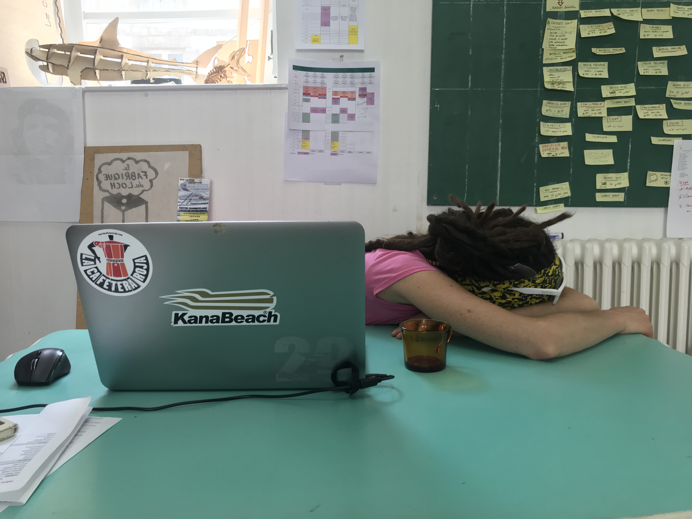

# Bilan des activités 2018

**Du 14/04/2018 au 26/04/2019**

Durant les treize mois de cet exercice, nous avons développé les activités suivantes, en cohérence avec les six axes que nous nous étions fixés et qui sont la structure de notre projet associatif.

## Les axes de notre projet associatif

{: width="250px" }
{: width="250px" }
{: width="250px" }

- **PROJETS** - Concevoir, réaliser et/ou accompagner des [projets innovants](axe-1-projets.md)

- **FAIRE** - Apprendre par le [Faire](axe-2-faire.md)

- **PARTENARIATS** - [Faire vivre des partenariats](axe-3-partenariats.md)  entre les acteurs locaux (associations, établissements publics, collectivités territoriales et entreprises) et le mouvement des makers

- **JEUNES** - [Accompagner des jeunes](axe-4-jeunes.md) dans leur démarche de professionnalisation

- **NUMERIQUE** – Sensibiliser aux [nouveaux usages numériques](axe-5-numerique.md) en réduisant les obstacles culturels et/ou sociauxs

- **TERRITOIRES** - [Contribuer au développement durable et à la capacité de résilience des territoires](axe-6-territoires.md)

Ces activités n’auraient pas pu exister sans **l’aide des bénévoles, leur disponibilité, leurs compétences** (et il existe un très beau panel de compétences à la FDL) et surtout leurs envies. **Un grand merci à eux**, certains ont vraiment tout donné!

{: width="600px"}
