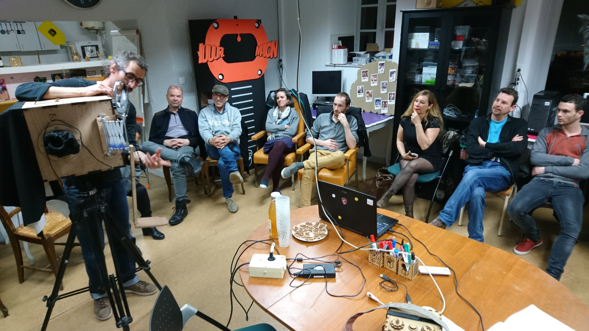

# Axe 1 - Concevoir, réaliser et/ou accompagner des projets innovants

## Apéro-projets
Nous avons continué à organiser les apéro-projets, notre rendez-vous mensuel et marque de fabrique, dans différents domaines (culturel, éducatif, économique, développement durable). L’audience peut aller d’une douzaine à plusieurs
Ces r**éunions conviviales** permettent à tout adhérent de présenter son projet, d’échanger avec les personnes présentes et de constituer éventuellement une équipe de travail. L’idée étant de favoriser la mutualisation des compétences et de documenter les réalisations.

Nous ne citerons pas tous les projets de ce mandat, mais nous évoquerons des projets collectifs internes à La FDL : la sandbox, le hurlomaton (toujours), la compta.

{: width="500px"}

## Séances de design thinking
Lors du FAB14, à Toulouse, en juillet dernier, Sébastien a participé à un atelier de design thinking.
A plusieurs reprises, il a eu l’occasion de partager cette méthode.

## L’accompagnement de projets extérieurs
La FDL a organisé 3 séances d’une journée avec les lycéens du Lycée Benjamin Franklin d’Auray dans le cadre de l’atelier coopératif « expression des jeunes » initié par le Pays d’Auray et soutenu par le programme européen Leader. L’implication des lycéens a été impressionnante, produisant 3 maquettes d’1/2m2 chacune illustrant une dizaine de projets innovants.  L’un des projets “Stopsûr” a même **été retenu par les élus locaux** qui vont le porter. Juju et Lucas ont également animé une soirée avec les jeunes au Mamm Douar Kafé et les 2 autres associations intervenantes : les graffeurs Des Gens Déjantés et les vidéastes XX (Hurlomaton).

## Des projets individuels développés grâce au fablab
Création d’une imprimante 3D format XXL financée par Loïc pour la FDL et  et une autre pour la clinique vétérinaire de B. Franklin perm, deux projets mis au point par Fred…qui ne se limite pas à inventer car il accompagne de plus des jeunes à découvrir leurs capacités à faire en apprenant le dessin 3D, le paramétrage des machines, imaginer.

## L’accueil de CampTIC
L’association lorientaise CampTIC a demandé au conseil d’administration l’autorisation d’héberge leurs controverses numériques dans les locaux de la FABrique du Loch; la requête a connu l’unanimité enthousiaste du conseil.
CampTIC organise les controverses numériques, série de conférences abordant l'impact du numérique sur notre société, notre quotidien.
