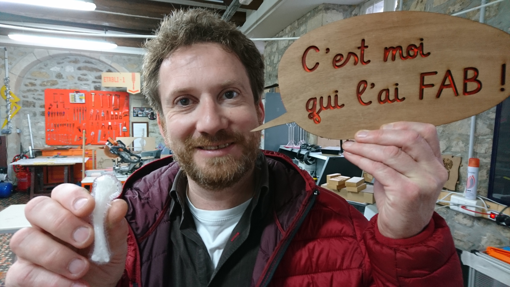

# FAIRE - Apprendre par le Faire

*Donner à nos adhérents les compétences requises pour les nouveaux usages numériques*

{: width="500px" }

Nous touchons **un public très varié** aux demandes diverses : particuliers, scolaires, salariés, auto-entrepreneurs, entrepreneurs, artisans, associations, services techniques des collectivités.

## Formations
La FABrique du Loch forme ses adhérents à l’utilisation de ses machines en visant leur autonomie technique et numérique.

En 2018, près de **150 formations** à l’utilisation des machines ont été dispensées, contre 120 en 2017.

{: width="500px"}

- A l’instar des précédentes années, la demande pour appréhender l’utilisation de la **découpe laser** a été majoritaire et pas moins de **79 personnes**,
- Vient ensuite la formation à l’**impression 3D**: **42 adhérents** ont été formés,
- et enfin, **21 adhérents** sur la **découpe vinyle**.

{: width="500px" }

## Ateliers informatiques
L’apprentissage passe aussi par des ateliers informatiques généralement gratuits, animés par des tuteurs bénévoles :
- langage informatique,
- image vectorielle Inkscape,
- dessin 3D Blender.

Au total, plus de **20 ateliers** ont été organisés tout au long de l’année et notamment le mardi soir.
Des ateliers matelotages, ainsi que des “close up”, ateliers de magie, ont eu lieu également toute l’année 2018.

Ils ont permis de transmettre des savoirs et des expériences.

### Code LAB et Wanabicodeur
Depuis mars 2019, une formation a été conçue et dispensée par Antoine et Arnaud, de manière à apprendre à nos adhérents volontaires à coder en vue de la création de sites Web, d'applications mobiles (Android, iOS ...), de logiciels pour PC & Mac, de logiciels embarqués (Arduino...).

Des synergies autour du code se développent. Seb, un bénévole ne comptant pas ses heures, a permis à d’autres adhérents, et services civiques de découvrir l’univers du code en ligne. Depuis mars, les enfants (quelques adultes aussi) découvrent le quotidien d’un codeur, éditeurs de texte et partage du codes à l'atelier Wanabicodeur (merci **Arto** pour le nom de la formation).

## Le Break
En janvier, la FABrique a fait **le Break**!
3 semaines de partage autour d'activités culturelles et sportives, sous forme d'un jeu

{: width="500px"}
