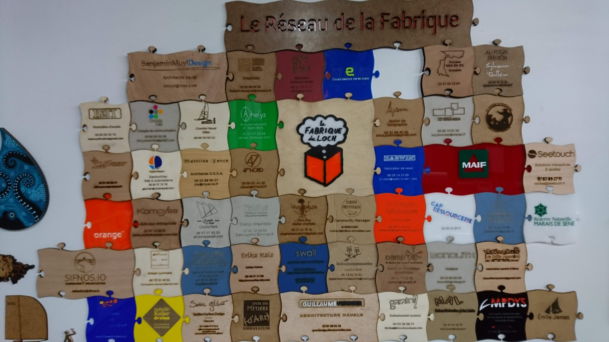
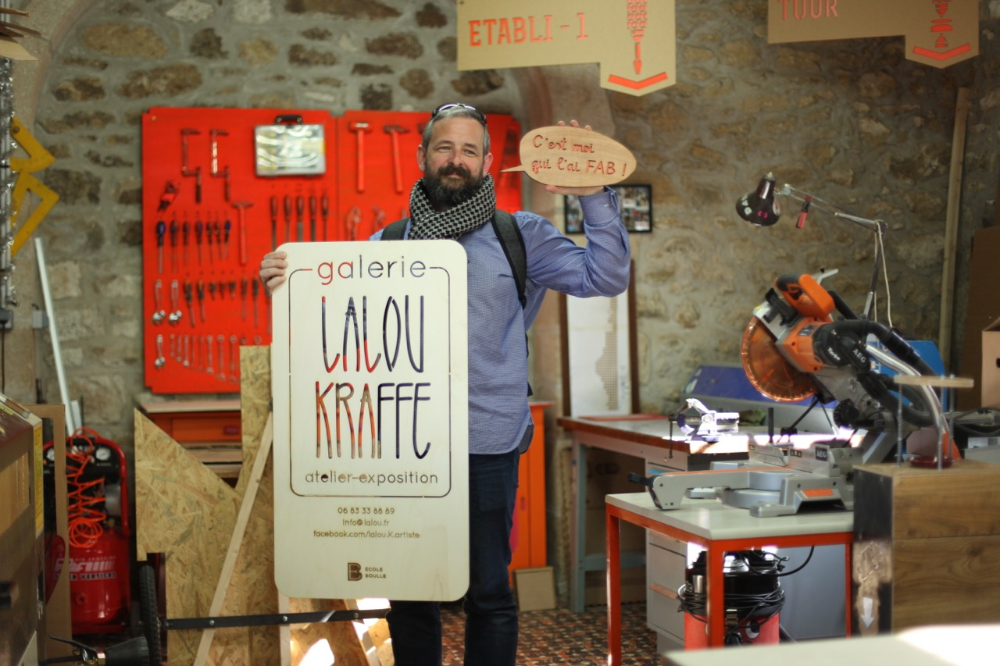
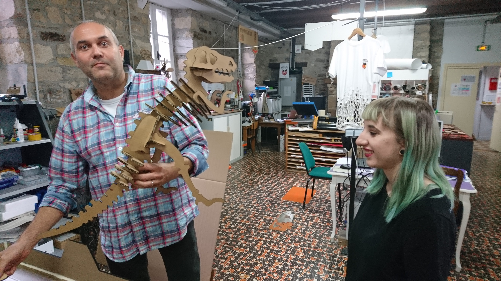
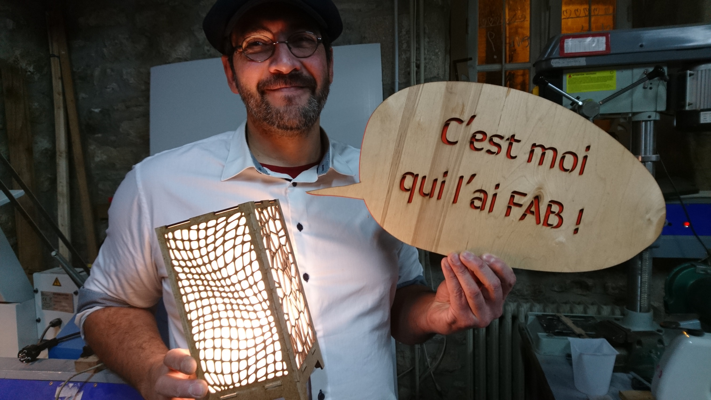

## PARTENARIATS - Faire vivre des partenariats entre les acteurs locaux et le mouvement des makers

Ces partenariats ont pris en 2018 la forme de conventions signées avec des acteurs économiques, éducatifs et culturels du territoire (associations, établissements publics, collectivités territoriales et entreprises), tels que:
- la ville d'Auray et le pays d’Auray,
- le lycée des Métiers d’Art Duquesclin,
- la MAL, la Mission locale du Pays d’Auray,
- le musée de Préhistoire de Carnac,
- l’Argonaute,
- Clim’actions Bretagne sud,
- le parc naturel du golfe du Morbihan,
- l’ENVSN,
- Enédis

9 associations sont adhérentes à la FDL.

Nous entretenons des relations étroites avec par exemple le Pays d’Auray, via des réalisations concrètes (voir [projets](axe-1-projets)).

Ces relations doivent être prolongées et élargies à de nouveaux partenaires comme AQTA, la Région Bretagne et également de nouveaux partenaires privés.

## Entreprises
S’agissant des entreprises, La FABrique du Loch totalise une 50 adhésions (5 PME et 45 professions libérales, auto-entrepreneurs, artisans et artistes). Nous intervenons en tant que facilitateur de projet (mise à disposition des machines et des outils numériques, aide matérielle et technique).

{: width="500px" }

Cette participation des entreprises est **en augmentation** par rapport à l’exercice précédent, mais elle doit encore se renforcer de manière à contribuer à la pérennité de l’association.

Nous devrons donc :
- **nous rapprocher des entreprises locales**, notamment de celles qui sont impliquées dans **le nautisme et la plasturgie**, potentiellement les plus concernées par le fablab;

{: width="500px" }

- et signer de nouvelles conventions de **mécénat**.

Les résultats attendus sont une augmentation de l’utilisation des machines et de la location de l’atelier.

{: width="500px"}

Cet autofinancement doit contribuer à construire l’assise financière qui nous fait encore défaut.

## Formation professionelle
Lors de notre précédente AG, nous avions évoqué la possibilité d’investir le champ de la **formation professionnelle**. Bien que nous soyons enregistrés depuis février 2018 auprès de la DIRECCTE en tant qu’organisme de formation professionnelle, nous n’avons pas encore développé cette activité.

Il est à noter qu'**aucune formation à la découpe laser** n’existe pas à ce jour, en région Bretagne.

{: width="500px" }

## Participation au Réseau Francais des Fablabs
A l’échelle nationale, Juju a été élu au conseil d’administration du RFF (Réseau Français des FabLabs), lors de son AG en août 2018. Ainsi, pour la première fois, le grand Ouest, avec notamment la Bretagne, très en pointe ces 5 dernières années pour la création de fablabs, y est représenté.

## Réseau MIBS
Dans le domaine du numérique, nous participons activement au réseau MIBS (Makers In Bretagne Sud) qui rassemble les acteurs de la fabrication numérique ouverte et collaborative en Bretagne Sud.

Des exemples de collaboration vous sont présentés [ici](axe-5-numerique).

## Menuiserie ODO
Pour la réalisation des projets de nos adhérents, nous souhaitons pouvoir utiliser une gamme complète d’outils électriques et manuels de menuiserie. Ainsi, une convention avec la menuiserie ODO, située à Baden, est en cours de signature.
