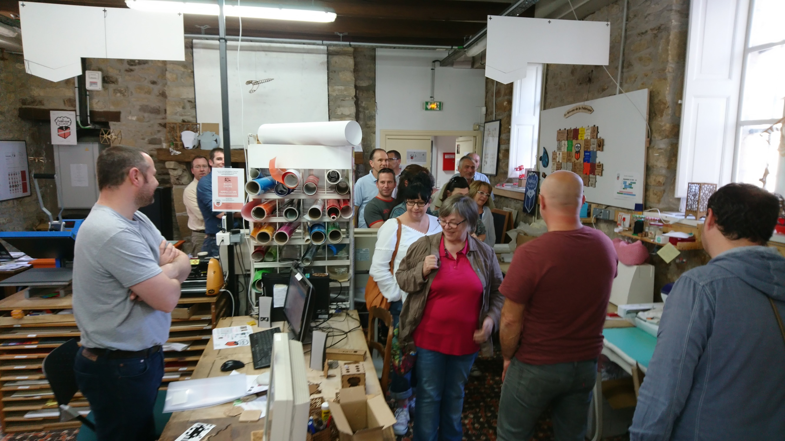
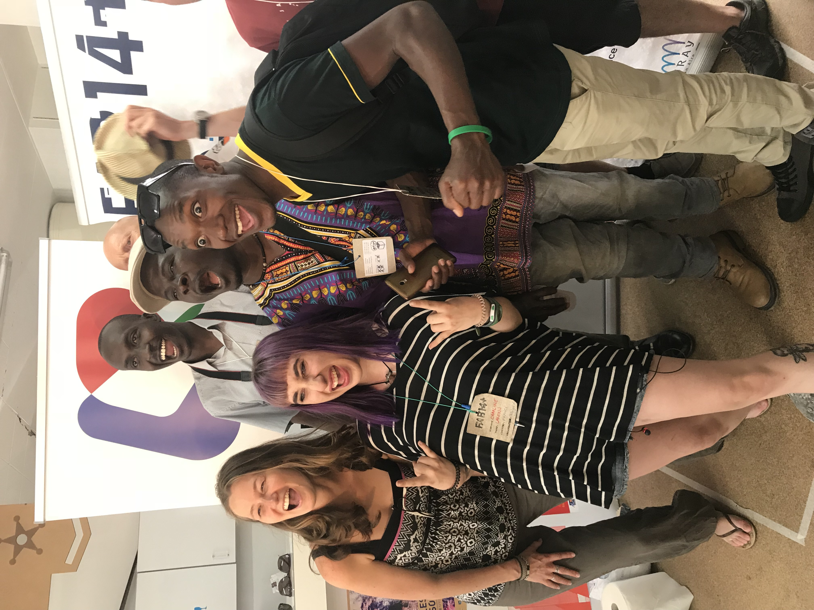
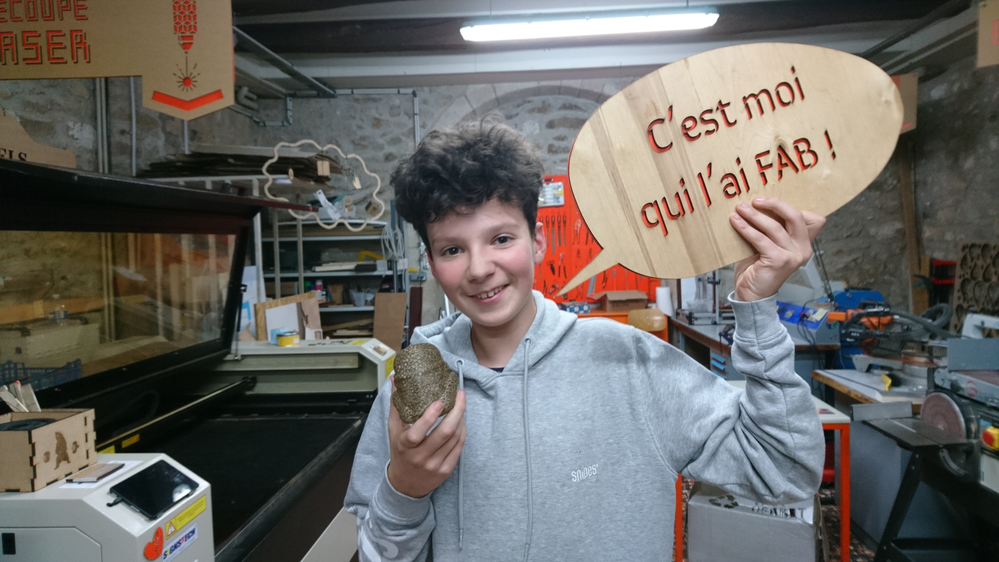

# JEUNES - Accompagner des jeunes dans leur démarche de professionnalisation

Nous notons toujours **la forte curiosité du monde socio-éducatif** envers La FDL.

Elle s’est traduite pour cet exercice par des visites de groupes d’établissements scolaires, l’accueil de stagiaires et de jeunes volontaires.

Nous avons réitéré des visites de nos ateliers et présenté le fonctionnement de nos machines:
- au Lycée des Métiers d’arts Duguesclin,
- au lycée Benjamin Franklin,
- St Gildas BREC’H,
- St Louis AURAY,
- Ste Anne d’Auray

{: width="600px" }

## Services Civiques
Depuis septembre 2017, dans le cadre d’un partenariat avec la **Mission Locale** du Pays d’Auray, La Fabrique du Loch accueille des jeunes volontaires en service civique pour une période de 9 mois (à raison de 26h hebdomadaires).

Ainsi, se sont succédés:
- Jusqu’à fin janvier 2018, Emile et Alexis
- Puis Charline (15 février 2018 - 14 novembre 2018),
- Lucas (1er juin 2018 - 28 février 2019) et
- Yacouba (26 juin 2018 - 14 janvier 2019) .
- Depuis le 11 décembre, Océane.
- Et plus récemment, (09/04/19) Émeline

Océane et Emeline ont toutes 2 pour mission de **lutter contre la fracture numérique**.

Ces jeunes représentent **une réelle plus-value** pour le fonctionnement du Fablab. Nous tenons à **les remercier** pour leur engagement, leurs compétences et, chacun à leur façon, pour leur bienveillance auprès des adhérents.

{: height="400px"}

## Stagiaires
Concernant, l’accompagnement de stagiaires, nous sommes **de plus en plus sollicités**.

Durant l’année 2018 et jusqu’à ce jour, nous avons accompagné **15 jeunes pour un total de 172 jours**.

Ainsi,nous avons accueilli :

- dans le cadre des stages de découverte en milieu professionnel des classes de 3ème, **4 élèves des collèges** St Gildas BREC’H, St Louis AURAY et Ste Anne d’Auray (pour un total de 20 jours)

- **4 élèves du secondaire des lycées professionnels**  d’Etel, Duguesclin, Priziac et **2 élèves en classe d’enseignement général** des lycées de Ste-Anne d’Auray et de Vannes, pour un total de 71 jours (contre 10 journées en 2017).

- Et enfin, comme l’année précédente, des étudiant-es de l’université de Cergy Pontoise, FACLAB, Olivier et Camille. Cette dernière travaille sur un projet de facilitateur itinérant et interfablab (soit un total de 47 jours)

{: width="600px"}

## Publics fragilisés
Pour la 1ère année l’accueil de publics fragilisés, ce qui représente **34 journées d’accompagnement** fait l’objet de conventions de stage avec :

- l’AMISEP,
- un dispositif de pré-insertion de la Mission Locale
- et un de lutte contre le décrochage scolaire.

## Semaine des Métiers d’art
Enfin, dans le cadre de la Semaine des Métiers d’art organisé à **L’Argonaute**, à l’instar de l’année précédente, nous venons d’animer un atelier **« Découverte des nouveaux usages du Numérique »**.
