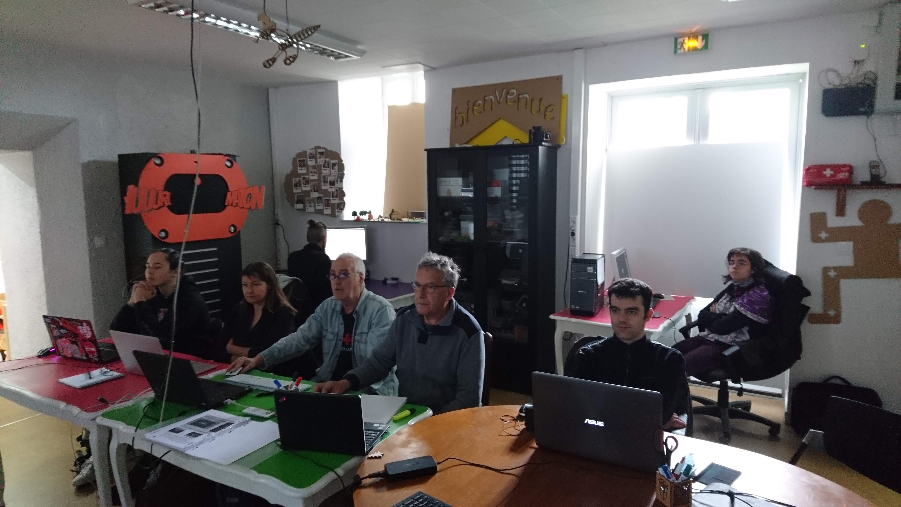
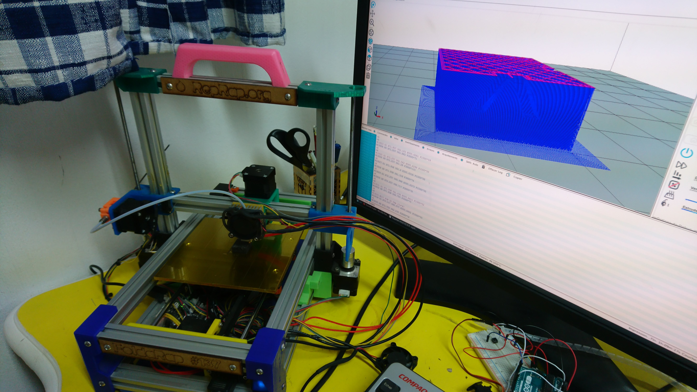

# NUMERIQUE – Sensibiliser aux nouveaux usages numériques en réduisant les obstacles culturels et/ou sociaux

Nous menons une politique volontariste dans ce domaine précis, parce que nous souhaitons favoriser l’intergénérationnel et la mixité sociale de nos publics. Ainsi, nous assurons un accueil chaque samedi matin (visite des ateliers).

## VendrediMoiTout
Par ailleurs, nous avons organisé 9 **Vendredimoitout,** conférences participatives ouvertes à tous , sur différents thèmes en lien avec le numérique :

- 20 avril : SCIC (sociétés coopératives d’intérêt collectif)
- 18 mai : Creative Common, la créativité partagée
- 22 juin : la place des initiatives citoyennes dans la gestion des données énergétiques avec l’intervention d’ALOEN et EMPOWER
- 28 septembre : le smartphone est-il l’avenir de la photo ?, en collaboration avec l’association Camp’TIC, qui reste notre partenaire privilégié.

Petit bémol : bien que le niveau et l’intérêt de ces mini-conférences interactives soient montés en flèche, la participation du public reste volatile et trop faible.

## Inclusion numérique
Toujours dans l’objectif de contribuer à l’inclusion numérique par la découverte des nouveaux usages, nous continuons d’avoir très régulièrement des **visites sur rendez-vous** d’acteurs du territoire :

- Conseil de développement du Pays d’Auray (CODEPA)
- Multi-accueil Gribouille
- bibliothèque Crac’h
- Dominitis
- Enédis
- mensuel du Golfe
- CAF
- CPAM
- Inclusion numérique
- ENVSN
- ESAT à Brec’h (5 août)
- 5 professeurs de l’école élémentaire publiques du Loch à Auray (17 octobre)
- Service Enfance-Jeunesse de St- Avé (13 février),
- lycées de Chinon et de Duguesclin,
- 1 conseiller en insertion du Conseil Départemental du Morbihan.

{: width="600px" }

## Communication
Dans le but d’accroitre la visibilité de nos activités, nous avons développé différents outils de communication. Nous avons ajouter des pages à notre site Internet, **étoffé notre FABLETTER****,** mensuel présentant le programme du mois à venir.

Pour communiquer sur les projets, nous menons la campagne des bulles **“c’est moi qui l’ai FAB”** ou **“c’est nous qui l’avons FAB”** (de la conception du support au collage) et nous diffusons l’information avec l’aide des réseaux concernés.

De plus, comme chaque année en septembre, nous avons participé au **Forum des associations** organisé par la ville d’Auray. Cet événement assez prisé par les habitants de notre communauté de communes a regroupé en 2018 une centaine d’associations alréennes.

La communication reste à privilégier pour le mandat à venir.

### La réalisation de tutoriels
Depuis le début de l’association, des tutoriels ont été créés sur l’utilisation des machines, leurs réglages et nous devons beaucoup à un bénévole qui s'est beaucoup investi pour la Fabrique, Ludo. Ces tutoriels ont été transcrits en documents **publiés sur le web** pour un accès plus facile à cette documentation et dans le respect de nos valeurs de partage.

La création de contenu permet à la FABrique du loch d’augmenter sa visibilité sur l’Internet.

{: width="600px" }
