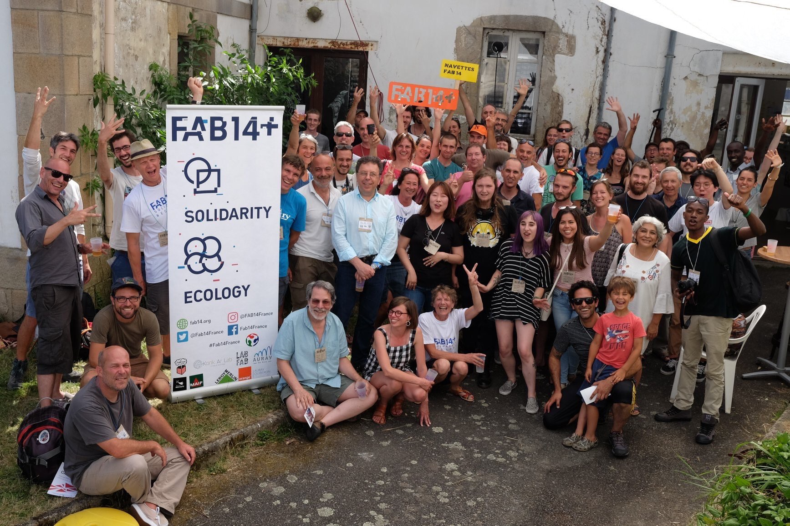

# TERRITOIRES - Contribuer au développement durable et à la capacité de résilience des territoires

## FAB14 DISTRIBUTED - WEST
La FDL a pris l’initiative de se proposer pour être l’une des 10 “villes-étape” de FAB14, **la 14ème Conférence internationale des Fab Labs**, l’événement mondial des makers, durant deux jours (14 et 15 juillet). Ainsi, une XX de personnes ont pu assister à des conférences, ateliers, expositions et rencontres sur deux thèmes précis : **Make ecology et Health & Solidarity**.

**22 conférences et 11 ateliers** se sont déroulés dans 3 lieux en centre-ville.
Au total, **73 makers de 10 nationalités** et **37 bénévoles** ont accueilli à La FDL **500 personnes**.

300 repas chauds ont été servis tout au long du weekend.

Bouquet final, du 16 au 22 juillet : les makers ont continué leurs échanges à Toulouse. Au-delà de ces 2 jours à Auray, l’intérêt de FAB14 a résidé dans la création de synergies entre les fablabs du Grand Ouest et des fablabs étrangers.

{: width="600px"}

{: width="600px"}

## Herbes Folles à St Nolff le samedi 23 février
Nous adhérons au pôle de l’ESS, le pôle PEPS-pôle de l’économie positive et solidaire. Pour le mois de l'économie sociale et solidaire, La Fabrique du Loch et Camp'TIC se sont associés pour proposer une conférence autour du thème **La citoyenneté & le numérique** (Vendredi 23 novembre 2018).

## Evènements extérieurs
Concernant le **grand public**, nous avons participé à **divers événements extérieurs :**

- les 20-21 janvier, lors d’un évènement de *Makers*, « le MIBS DAY » à Quiberon,  nous avons animé des stands de démonstrations et des ateliers d’activités collaboratives.
- Des stands de démonstration pour des événements extérieurs autres que « maker » : Récréa’bric à Saint-Anne d’Auray le 30 mars,
- JEMA (Journées Européennes des Métiers d’Art) à l’Argonaute, du 5 au 7 avril 2019

## Install Party et Repair Café
Nous avons organisé des ateliers gratuits ouverts au public :

- une «Install party» pour le téléchargement de packs de logiciels libres à la demande des particuliers, le samedi 13 octobre avec notre ex-partenaire Rhizome. Fondée en 2003, l'association Rhizomes a œuvré jusqu'au 31 décembre 2018 dans le Morbihan à la promotion des Logiciels Libres.
- le samedi 16 mars 2019, un Repair Café, « samedideréparer » et pour la 1ère édition « Samedideredesiner », où il s’agit de réparer ou relooker plutôt que de jeter pour lutter contre l'obsolescence (programmée ou non) des appareils usuels et ainsi, limiter les déchets.

## Openstreetmap
Antoine nous a rejoint avec des compétences en code et en plateforme collaborative de cartographie. C’est un terrain de jeu qui s’ouvre pour tout enfant et adulte qui souhaite découvrir facilement l’intérêt de la cartographie, sur la base de la base de données cartographique contributive OpenStreetMap. Une première OpenStreetMap party a été organisée.
