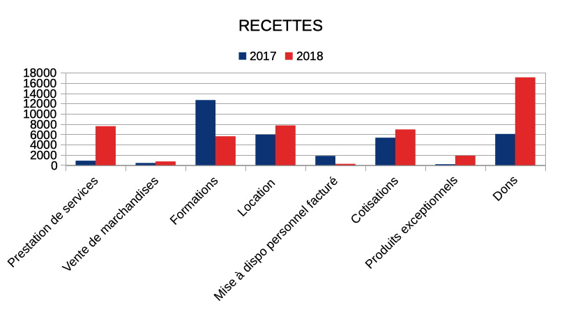
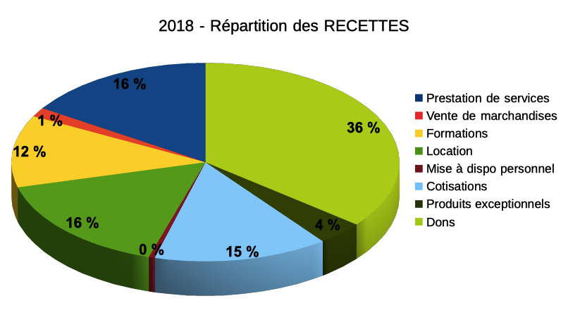

# Bilan financier 2018

Malgré les nombreuses activités que nous avons développées durant ce mandat, nous rencontrons toujours des difficultés financières ne nous permettant pas de rembourser nos dettes. La phase critique de trois ans de fonctionnement n’a pas permis d’asseoir un fonds de trésorerie, ce qui fragilise la pérennité de l’association.

Notre bilan financier de l’association est certifié par le cabinet comptable CERFRANCE.

Quelques éléments:

|----------------------------------|-------:|------:|------------------------------------------|-------:|--------:|
| **PRODUITS*                      |  2018	| 2017	|  **CHARGES*                              |  2018  |   2017  |
|----------------------------------|-------:|------:|----------------------------------- ------|-------:|--------:|
| Vente de marchandises	           |   705	|   414	| Achat matière 1ère	                     |   201	|    198  |
| Prestation de services           |  6917	|   859	| Autres achats non stokés et charges ext	 | 15067	|   9078  |
| Formations	                     |  5614	| 12687	| Salaires et charges sociales	           | 43746	|  60485  |
| Location 	                       |  7735	|  5957	| Impots et taxes	                         |   869	|    808  |
| Mise à dispo personnel	         |   238	|  1808	| Amortissement et provision	             |  9186	|   9552  |
| Cotisations	                     |  7641	|  5527	|                                          |        |         |
| Subventions d’exploitation	     |  7200	| 34398 |	                                         |        |         |
| Reprises et transferts de charge | 15271	|   880	|                                          |        |         |
| Dons	                           | 17112	|  6084 |	                                         |        |         |
|----------------------------------|--------|-------|------------------------------------------|--------|---------|
|  TOTAL	                         | 68433	| 68614	| TOTAL	                                   | 69069	|  80121  |
|----------------------------------|--------|-------|------------------------------------------|--------|---------|
|                                  |        |       |                                          |  -636	| -11507  |
|----------------------------------|--------|-------|------------------------------------------|--------|---------|
