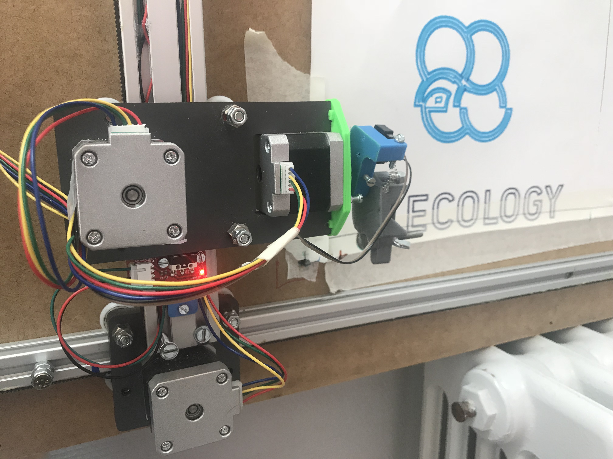
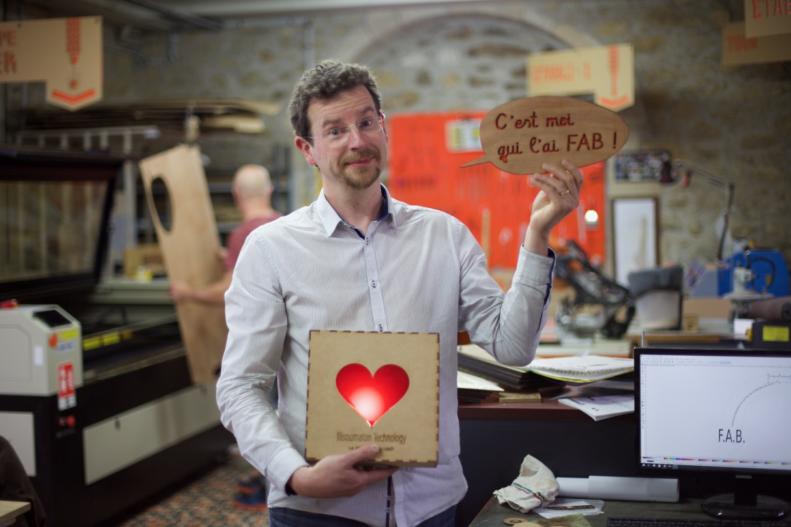
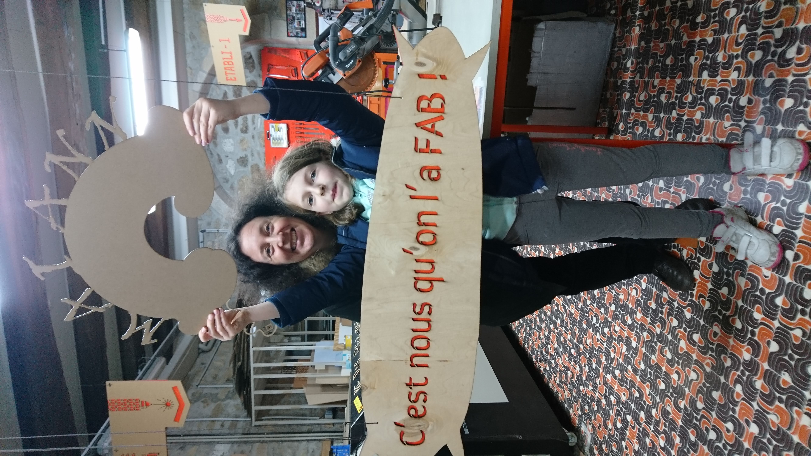
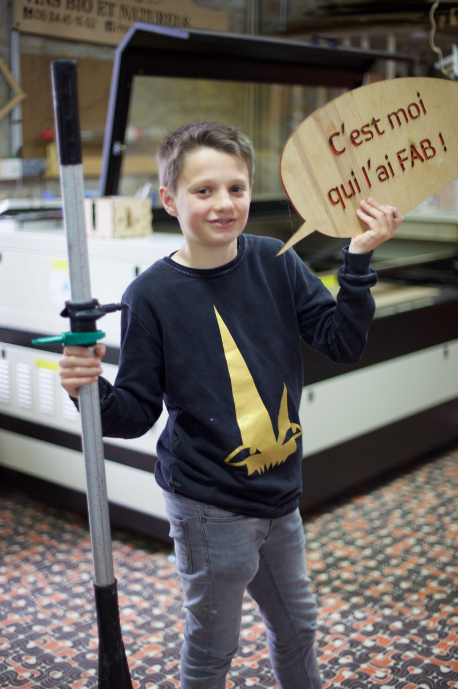

# Orientations 2019

La Fabrique du Loch, après 3 ans d'existence, doit aborder une nouvelle étape.
Dès la première année, nous avons réuni près de 250 adhérents, 300 aujourd'hui.
Des personnes en recherche de faire, des entreprises en recherche de compétences.

Le parc de machines, les heures d'ouverture font de La Fabrique du Loch un des fablabs
les plus accueillants. Elle le doit à ses fondations même, quand un groupe d'amis décident
de monter ce projet en dehors de tout cadre universitaire ou par volonté politique.

Aujourd'hui, le conseil municipal d'Auray soutient l'association en lui fournissant des locaux
hors du commun, en centre-ville, comme c'était le souhait des fondateurs.
Mais l'association reste toutefois dans un équilibre financier fragile.
Endettée, elle doit aujourd'hui apurer ses comptes dans un environnement où les subventions
sont encore difficiles à capter, malgré la correspondance entre les missions de l'association
et les volontés politiques de lutter contre la fracture numérique.

Rappelons qu'un Fablab est un prolongement des actions culturelles comme l'ouverture d'une
bibliothèque au siècle dernier, d'une médiathéque depuis quelques décennies.
Initiative citoyenne, il est indispensable que la Fabrique reste indépendante.

{: width="600px"}

## Les axes d’amélioration

### Assurer notre pérennité financière
Comme ce rapport d’activités le démontre, la FABrique du Loch a une nouvelle fois concrétisé de nombreuses rencontres, de nombreux projets.
Mais nous peinons à trouver un équilibre financier.

### Renforcer nos liens avec les acteurs locaux
Nos projets nous inscrivent directement dans la vie de la cité, par notre approche de l'éducation, de la relation entrepreneuriale. Nous sommes l'interlocuteur privilégié des acteurs locaux pour aborder les sujets de l'inclusion numérique, du rapport aux technologies.

### Renforcer notre partage des savoirs
Cours de code, de Blender, d’Inskscape, de Sketchup, OpenStreetMap…
Documentation en ligne

{: width="600px"}

### Réduire l’esprit de consommation
Le conseil d’administration a lors d’une de ses réunions, exprimé son doute sur le modèle constaté. D’une base certes solide de bénévoles fortement impliqués, certains adhérents ou public passe la porte du fablab pour une relation de services.

L’accueil de nos adhérents et de notre public doit orienter la démarche vers une relation de partage, notamment en termes de documentation des réalisations. Cela fait partie des valeurs portés par un Fablab.

La matérialisation de l’adhésion par une carte a de nouveau été évoquée lors des réunions du conseil d’administration.

### Conforter les projets déja entrepris
En 3 ans, la FABrique du Loch a été génératrice d’un grand nombre de projets impliquant souvent des acteurs très variés, de ses fabmanagers, à ses adhérents, ses bénévoles.

{: width="600px"}

### La sécurité
Les machines mis à disposition des adhérents impliquent le respect de règles de sécurité. Des formations sont dispensées régulièrement pour permettre une autonomie de la part de nos adhérents dans la réalisation de pièces.
Nous devons faciliter l’accès à la documentation nécessaire pour assurer la sécurité lors d’opérations avec les machines. La manipulation des consommables, parfois encombrant (comme les plaques de medium permises par la surface de notre découpeuse laser) et leur utilisation est un risque constant de notre activité.

### La communication
La FABrique du Loch est un vivier incroyable où beaucoup d’énergie est dispensée à transmettre entre adhérents et public passant la porte. Des process de communication sur les réseaux sociaux ont été réalisés autour de campagnes cohérentes avec nos valeurs “C’est moi qui l’ai FAB”.

Nous avons toutefois encore du mal à attirer à nos évènements un plus large public qu’un noyau d’adhérents.

Nous devons aussi mieux organiser notre communication auprès des entreprises locales, axe pour concrétiser nos efforts comme organisme de formation professionnelle.

{: width="150px" }
{: width="150px" }
{: width="150px" }

### Maintenance informatique
Nous disposons d’un nombre important de postes de travail (une vingtaine); ils constituent **les fondations indispensables** de toute activité numérique.

Comme tout système informatique, même basé sur un systèmes libres (GNU/Linux) solides, le parc informatique de la Fabrique requiert de l'entretien. Ouvert sur l’extérieur il nécessite des mises à jour système régulières.

En interne (réseau local), le choix et le paramétrage d’applicatifs pour effectuer toutes les tâches qui ne sont pas en liaison directe avec les machines (bureautique, dessin 2D et 3D et extensions, gestion des images…), nouveaux ordinateurs…

Cet entretien indispensable manque cruellement de personnes pour assurer ces tâches qui seules peuvent assurer la pérennité du parc.

À développer : un accès au réseau local depuis l’extérieur.

### La fracture numérique
La FABrique du Loch, comme toute organisation aujourd’hui, vit tous les jours **ses propres fractures numériques**. Des adhérents dont l'informatique est le quotidien à d'autres découvrant tout juste les ordinateurs, l'association construit des passerelles, le faire comme support à ces rencontres numériques.

#### Organisation
Nous progressons. Les conseils d’administration sont réguliers, sur un rythme soutenu, une fois par mois. Un ordre du jour est préparé sur une plateforme d’édition collaborative, puis complété lors de la réunion pour être, depuis peu, publié sur le web à son approbation.

#### Documentation
Depuis peu, les tutoriels stockés sur le serveur NAS ont été transcrits en fichiers publiés sur le web. Des cours autour de ces techniques sont dispensés depuis peu. Le partage de connaissances étant l'un de nos principaux objets, nous nous devons de renforcer la documentation des projets, des expériences vécues au Fablab.

#### Dolibarr
L’organisation de la comptabilité de la FABrique est en complète révision. Afin de faciliter le rapprochement entre la tenue comptable quotidienne et les imputations par notre Trésorière, Seb, encore lui, a mis en place un outil de comptabilité en ligne. Cet outil complet nous permet de gérer petit à petit différents pans de notre activité.

#### Le projet Algoric
Benoit, un adhérent expert en calcul parallèle, a su enthousiasmer l’ensemble du conseil d’administration à expérimenter le recyclage de machines à forte capacité de calcul au sein d’un fablab. Nous n’avons pas encore trouvé de lieu pour héberger ces machines, nécessitant un environnement spécifique que l’on peut retrouver
Nous avons pour le moment quelques promesses d’utilisation par des entreprises locales, mais les conditions d’hébergement peuvent impacter le prix de l’heure de calcul. Il a été établi au lancement de ce projet que le prix ne saurait être très inférieur aux solutions existantes privées.
