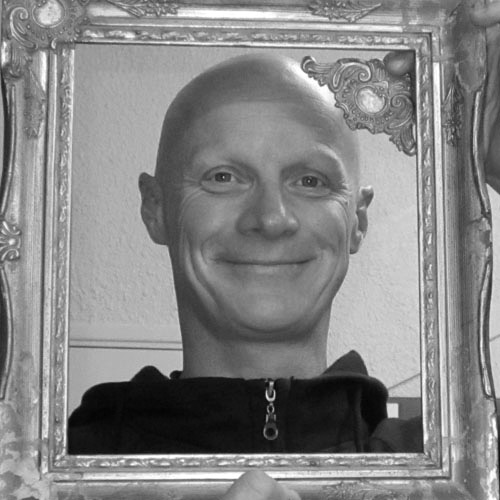

# L'association
{: width="120px"}

**Atelier partagé**, La FABrique du Loch est accessible à tous pour presque tout faire
- apprendre
- inventer
- fabriquer
- réparer

Des outils classiques et numériques sont mis à disposition des membres du FabLab pour réaliser leurs projets, qu’ils soient individuels ou collectifs, farfelus ou sérieux.

Le principe fondamental d’un FabLab est de **faire ensemble** et de **partager les connaissances**.

La FABrique du Loch est un lieu d’échange intergénérationnel et interdisciplinaire, où chacun vient, quel que soit son niveau, dans un esprit de convivialité et de tolérance.

La FABrique du Loch est soutenue par la [Mairie d'Auray](http://www.auray.fr) et le Pays d’Auray, qui accompagnent le projet depuis l’origine.

## La communauté

La FABrique du Loch regroupe près de 300 adhérents : particuliers et entreprises. A eux tous, ils représentent de nombreux savoir-faire qui font la richesse du fablab.

Qui peut-on croiser à La FABrique du Loch ? Des architectes qui viennent réaliser des maquettes, des designers qui créent le prototype d'un nouveau modèle, des entrepreneurs qui veulent produire de petites séries pour tester un marché, des étudiants qui ont un projet pédagogique ou personnel, des artistes en pleine création, des professionnels qui veulent fabriquer une enseigne ou des stickers pour leur vitrine, des chômeurs, des inventeurs, des curieux et tous ceux qui ont envie de créer quelque chose de palpable.

## Notre fabmanager

- Juju

## Services Civiques
- Lucas
- Océane

# Le Bureau de l'Association

- Marie Dubois, Présidente
- Jean Jacques, Vice-président
- Aurélie Culot, Trésorière
- Arnaud Ménard, Secrétaire

# Le Conseil d'Administration
- Gilbert Lauvergnier
- Adeline Ageneau
- Ludovic Béguin
- Fabrice Bonato
- Frédérick Martin
- Jean-Marie Huriez
- Valérie Jullien

## Les Fondateurs
L’idée est née en 2014 sous l’impulsion de quatre amis
- Patrick Jullien préparateur de bateaux de course,
- Benjamin Muyl architecte naval,
- Stéphanie Fiévé architecte DPLG, et
- Arnaud Schweitzer chef de projet.

Chacun a apporté une pierre à l’édifice afin de monter l’association qui a vu le jour en juillet 2015.
