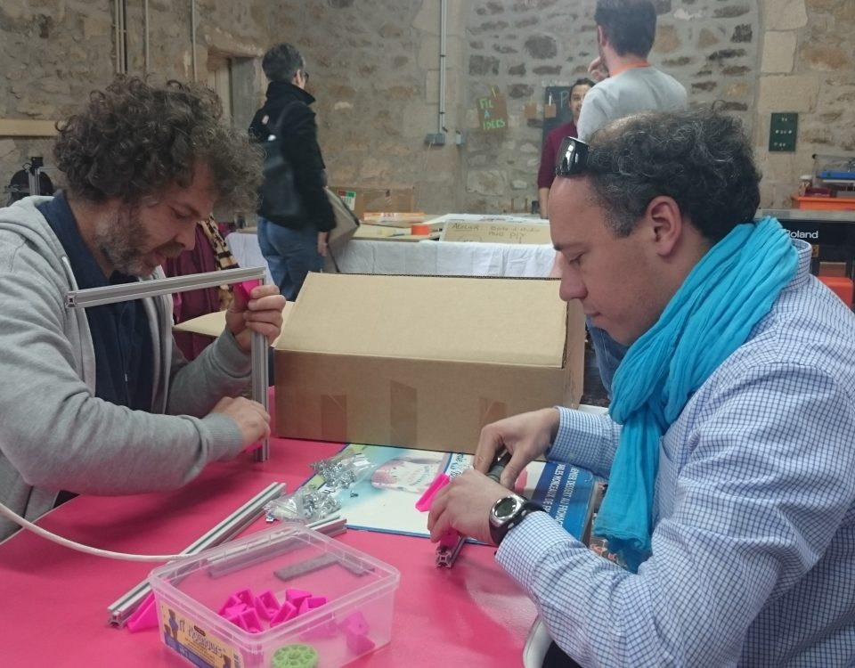

## Un Fablab, c'est quoi ?
C’est à la fois un lieu de fabrication d’objets et de partage de connaissances.

Un fab lab (contraction de l’anglais "fabrication laboratory", laboratoire de fabrication) est **un lieu ouvert au public** où sont mis à disposition des outils de toutes sortes, notamment des machines-outils pilotées par ordinateur, pour la conception et la réalisation d’objets.

Un fab lab, c'est aussi **un lieu d'échanges et de partage des connaissances** où toute personne, quels que soient son niveau de connaissance et ses moyens, peut venir se servir des machines mises à disposition pour réaliser ses projets personnels, scolaires ou commerciaux.

### A qui s’adresse la FABrique du Loch ?
À tous ceux qui ont un projet à réaliser, qu’il soit gros ou petit, simple ou compliqué.
- Aux *personnes* qui souhaitent apprendre à se servir d’un fer à souder, d’une imprimante 3D, d’une découpe laser ou d’une foule d’autres outils encore.
- Aux *entreprises* et aux *start-ups* qui cherchent à réaliser un projet ou un espace de travail pour grandir et collaborer.
- Aux *travailleurs indépendants* qui cherchent un espace de travail partagé (openspace)
- Aux *groupes scolaires* qui cherchent à réaliser un projet.

### La charte des Fab Labs
Afin de porter l’appellation de « FabLab », la structure doit entre autres *respecter la charte des FabLabs*, mise en place par le MIT.

#### Mission
Les fablabs sont rassemblés en réseau mondial de laboratoires locaux. Ils rendent l’invention possible en ouvrant aux individus l’accès à des outils à commande numérique.

#### Accès
Vous pouvez utiliser le fab lab pour fabriquer à peu près n’importe quoi (dès lors que cela ne nuit à personne). Vous devez apprendre à le fabriquer par vous-même et vous devez partager l’usage du lab avec les autres utilisateurs.

#### Education
La formation dans le fab lab s’appuie sur des projets et sur  l’apprentissage par les pairs. Vous devez prendre part à la capitalisation des connaissances et à l’instruction des autres utilisateurs.

#### Responsabilité
Vous êtes responsable de :

- La sécurité : savoir travailler sans abimer les machines et sans mettre en danger les autres utilisateurs.
- La propreté : laisser le lab plus propre que vous ne l’avez trouvé.
- La continuité : assurer la maintenance, les réparations, l'approvisionnement en matériaux et reporter les incidents.

#### Secret
Les concepts et les processus développés dans les fablabs doivent demeurer utilisables à titre individuel. En revanche, vous pouvez soit  les protéger de la manière que vous choisirez, soit les mettre dans les "communs" (open source).

#### Restrictions
Des activités commerciales peuvent être incubées dans les fablabs, mais elles ne doivent pas faire obstacle à l’accès ouvert. Elles doivent se développer au-delà du lab plutôt qu’en son sein et de bénéficier à leur tour aux inventeurs, aux labs et aux réseaux qui ont contribué à leur succès.

[Charte Original des Fablabs en Anglais](http://fab.cba.mit.edu/about/charter/)

Le Site du Fablab
[La FABrique du Loch](https://www.lafabriqueduloch.org/fr/la-fabrique/)
