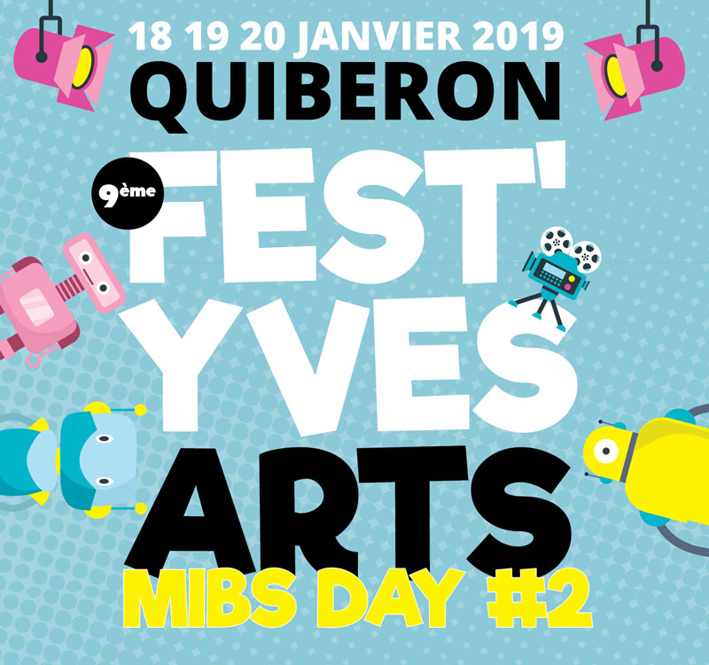
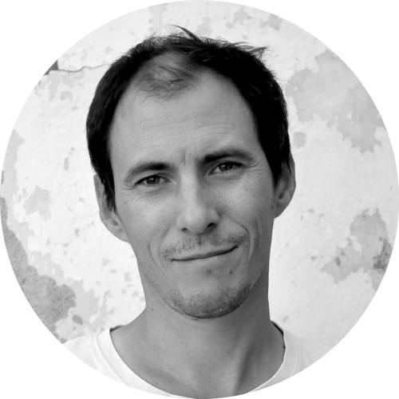
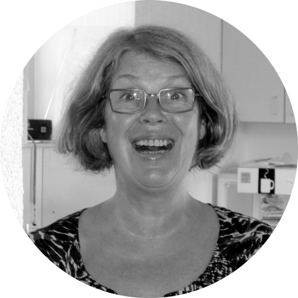
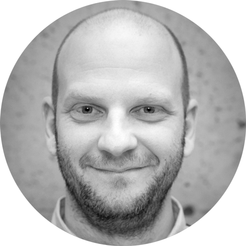

# En ce moment à la FABrique

## C'est **Le BREAK !**
Le Break a commencé !
Les fêtes de fin d’année vous ont fait abuser des bonnes choses?
La FABrique vous propose de faire un BREAK et de jouer!
On en parle dans le [Télégramme](https://www.letelegramme.fr/morbihan/auray/auray-alcool-en-janvier-le-fablab-fait-sa-cure-06-01-2019-12176678.php)

## Pour les curieux, du 18 au 20 janvier, les **MIBS Days** à Quiberon!
La seconde édition du MIBS Day aura lieu à Quiberon.
L'occasion de venir en famille rencontrer d'un coup tous les Makers de Bretagne Sud et leurs créations!

## Controverse le vendredi 25 janvier!
Pour cette 30ème édition des controverses numériques,
Les Controverses du Numérique de Camp'Tic nous surprennent pour la 30ème édition.

# Bienvenue à la Fabrique du Loch

Trois bonnes raisons d'adhérer à La FABrique du Loch
1. **Réaliser ensemble** des projets concrets et stimuler sa créativité
2. **Apprendre à faire** soi même, avec l'aide des autres
3. **Rencontrer** des personnes inspirantes et grandir ensemble

# J'aime La FABrique parce que...

| {: width="150px"} | "Le fablab me permet de développer des prototypes rapidement et de rencontrer des gens qui peuvent m'aider à réaliser mes projets.", **Vincent** |

| "Je suis entrée parce qu’il y avait de la lumière. J’avais une question à poser. Ils ont été trop sympas. Du coup, je suis revenue… en proposant de leur donner du temps. Et hop, aussitôt dit, aussitôt "embauchée". Que du bonheur !", **Laure** | {: width="150px"} |

| {: width="150px"} |
"Je viens de m'installer à Auray et grâce au fablab, j'ai pu rencontrer des personnes vraiment intéressantes. Aujourd'hui c'est devenu un peu ma deuxième maison.", **Xavier** |
