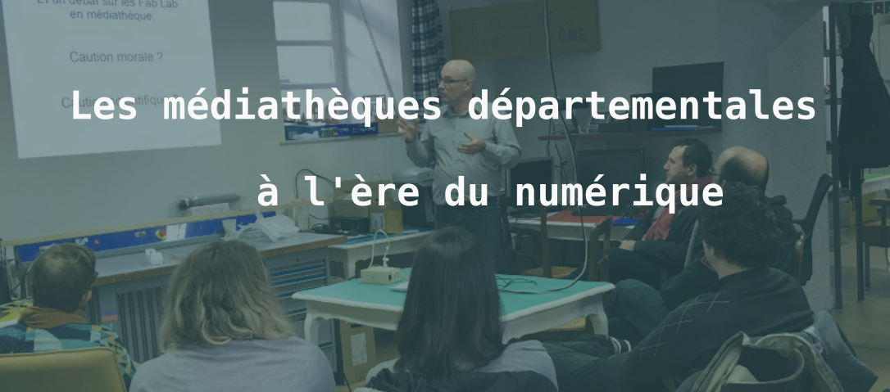

# Les médiathèques départementales à l'ère numérique

Cette année, les médiathèques départementales du Morbihan (MDM) se sont associées à la Fabrique du Loch, dans le cadre d'une réflexion autour du numérique. S'imposant de plus en plus comme phénomène de société c'est un sujet que les participants avaient à coeur de promouvoir dans leur structures respectives. Les médiathèques veulent mettre à disposition de leurs publics les outils et les connaissances du numérique. Ce partenariat était l'occasion de se former, au sein de la Fabrique du Loch, autour de technologies de fabrication pour pouvoir **appréhender et développer des projets numériques dans les médiathèques**.

A raison d'une journée complète par mois, la Fabrique à accueilli les volontaires de ce programme : bibliothécaires de **Séné**, d'**Auray** ou encore de **Quiberon**. Certains étaient déjà partisans du numérique ( certains s'investissant déjà dans des activités comme Morbicraft ou proposant l'accès à des imprimantes 3D) et d'autre des novices de la fabrication numérique. Une équipe s'est formée pour créer deux projets originaux qui ont été développé au sein de la Fabrique du Loch. C'était de plus un temps de rencontre entre ces acteurs décidés à passer à l'étape des bibliothèques 2.0.

Montage des pièces imprimées en 3D

# Le Drawbot
Le premier projet choisi a été un Drawbot (ou **robot de dessin**) sur le modèle de celui conçu par Frédérick Fleury. De la conception au montage définitif, quelques uns de nos bénévoles ont encadré les différentes équipes. **Impression de pièce en 3D**, perçages, **montage électronique**, **tutoriel informatique** et décoration, rien n'a été épargné à nos apprentis makers, qui sont repartis à la fin avec leur projet, destiné à s'échanger entre médiathèques.

Derniers essai avant la déco

# La Borne d'Arcade
Le second projet choisi était une borne d'arcade personnalisée pour le plaisir des grands et des petits amateurs de jeux rétro. La conception à été entièrement réalisé au Fablab. Les tâches ont été réparties entre différentes équipes pour que chacun puisse s'essayer à la compétence qu'il voulait acquérir.  

Le résultat est super et il a déjà fait des émules étant donné qu'une seconde borne à été fabriqué dans le cadre de ce projet et une troisième trône dans le hall de la Fabrique du Loch!

Montage de la tablette de jeu, atelier décoration et montage de la borne

Etaient aussi au programme des formations plus tournées autour de l'**informatique** et notamment du **dessin 2D**.  Ce moment de formation et de découverte de la fabrication numérique était l'occasion pour le fablab de créer des nouveaux liens avec des structures engagées dans la transition numérique, et nous attendons avec impatience de poursuivre cette collaboration autour de nouveaux projets 2.0 déjà à l'étude dans les médiathèques.  

La mise en commun des compétences va de plus aboutir à la rédaction de tutoriels accessibles à tout un chacun pour répliquer simplement ces projets, à la maison ou à la Fabrique du Loch. Alors restez connectés, on vous reparlera bientot des bornes d'arcade !

La borne d'Arcade entre en fonction !
