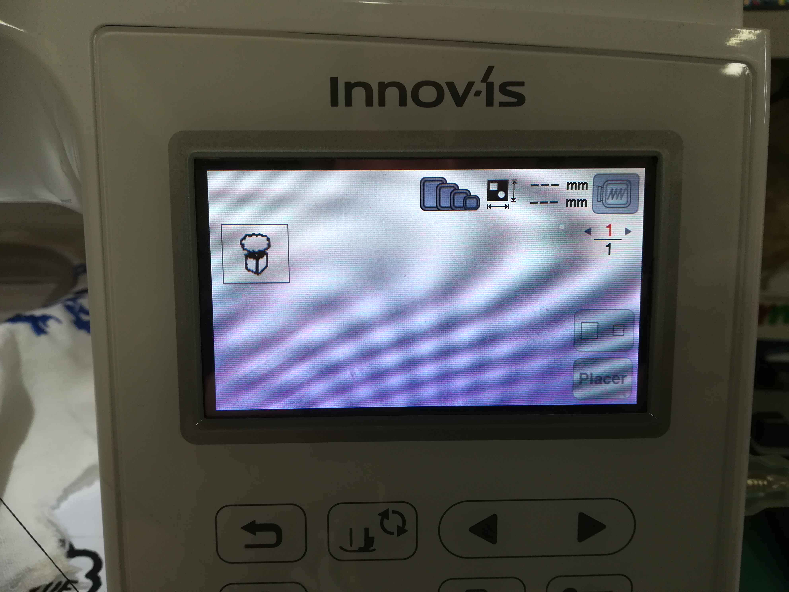
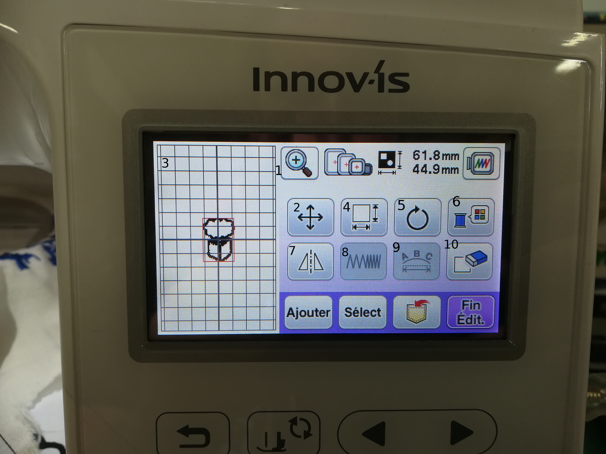
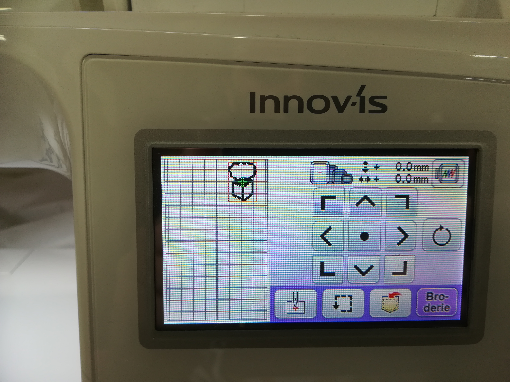
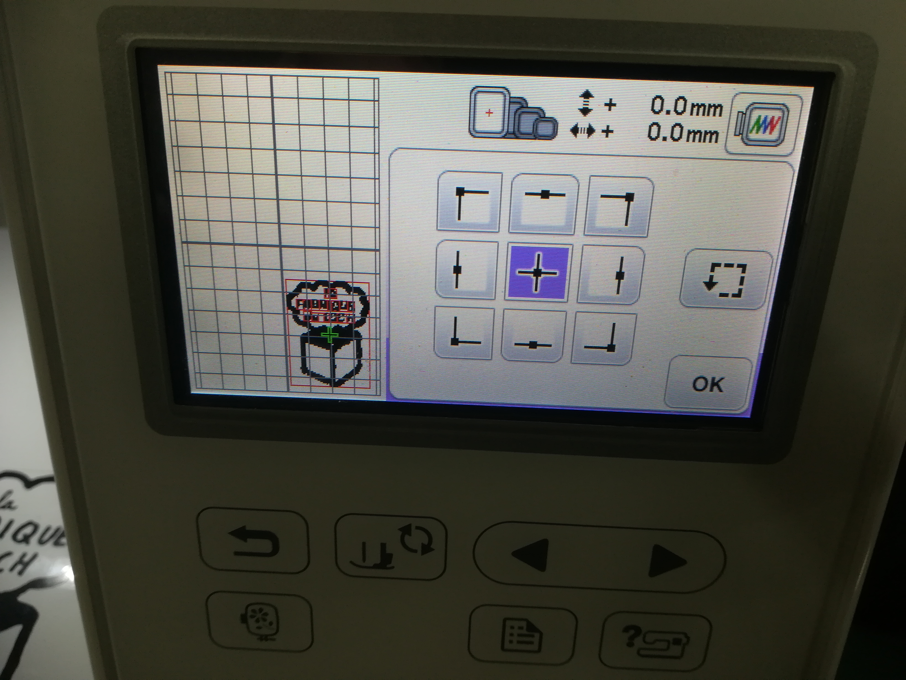
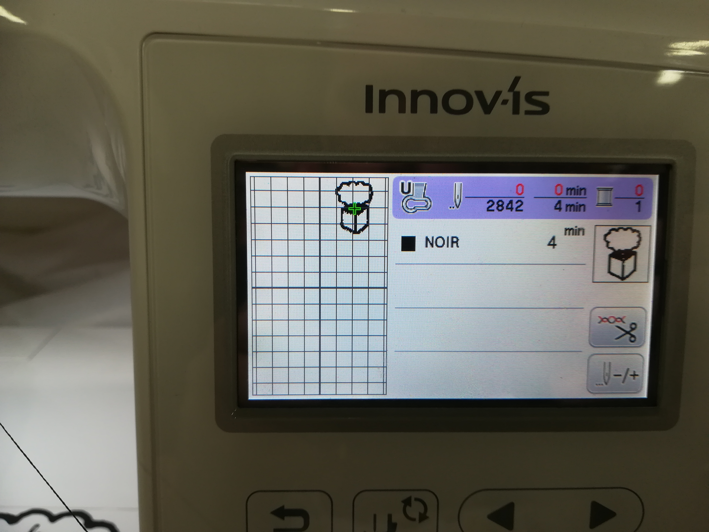
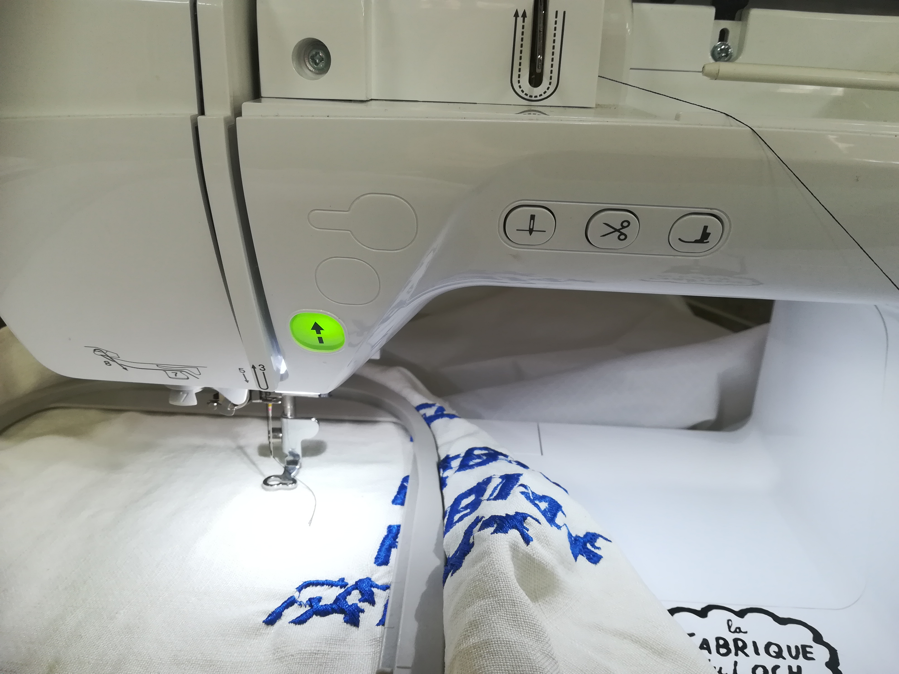

### importer son motif et démarrer la broderie

Maintenant que votre fichier est sur un support, il ne vous reste plus qu’à brancher le support en question sur le port USB de la machine, appuyer sur l’icône « USB » de la machine.

Vous arriverez alors sur un écran vous permettant de naviguer dans votre clé USB, à partir de là, vous pouvez aller dans le dossier contenant vos fichiers de broderie et sélectionner celui qui vous intéresse.

Vous voilà désormais sur un écran représentant votre cadre à gauche et avec différentes options à droite qui sont

1) Zoom
2) déplacer le motif sur la grille
3)visualisation du placement du motif par rapport au support
4) modifier la taille du motif
5) faire pivoter le motif
6) changer la couleur du motif
7)inverser le motif sur l’axe vertical
8) remplissage de la broderie (texte seulement)
9) réglages du texte
10) effacer le motif

Durant toutes ces modifications, le cadre de broderie restera sur place, mais dès que vous les aurez validé, la machine se mettre en position.
Une fois tous vos réglages prêt, appuyez sur « **fin edit**. », vous vous retrouvez face à un menu très similaire à celui de placement du motif, mais cette fois la machine déplacera le cadre de broderie, vous pourrez ainsi avoir une meilleure idée de l’emplacement de votre broderie.

À partir de cet écran, vous pouvez aussi appuyer sur la touche contour (le carré en pointillé fléché) vous permettant de vous placer sur les bords du motif, et en faire le tour afin d’avoir une idée plus précise de l’emplacement de cette dernière.

Une fois ceci fait, il ne vous reste plus qu’à appuyer sur « broderie ».
Vous serez alors amener à l’écran « broderie », vous listant les travaux prévus.
Le bouton +/- vous permet ici de choisir à quel moment de la broderie vous voulez être au coup d’aiguille près !

Vous n’avez plus qu’à appuyer sur le bouton d’abaissement du pied de biche, le bouton de lancement de la broderie passera ainsi du rouge au vert, vous signalant que la broderie débutera dès que vous appuierez dessus.

Une fois la borderie terminée, vous pouvez sortir le cadre, retirer le support et découper votre broderie pour la récupérer.
