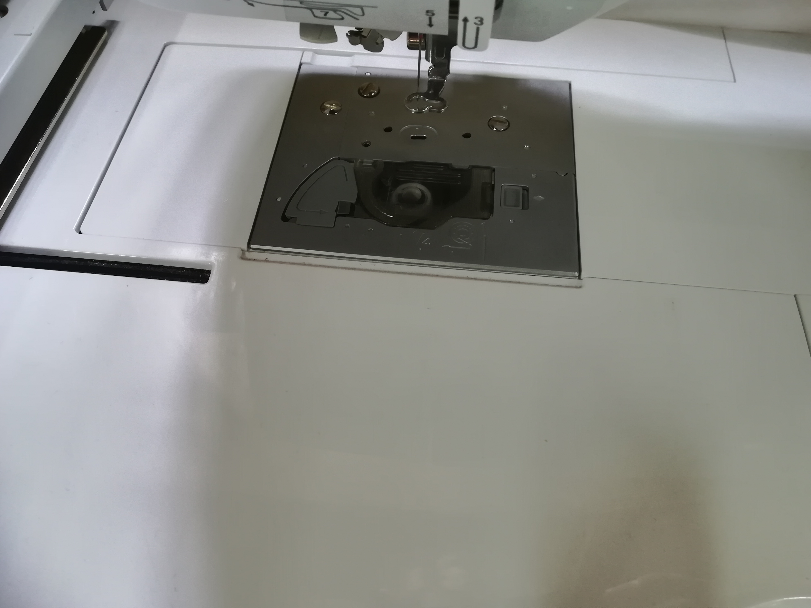
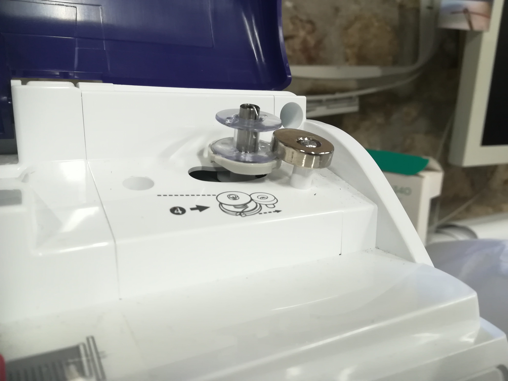
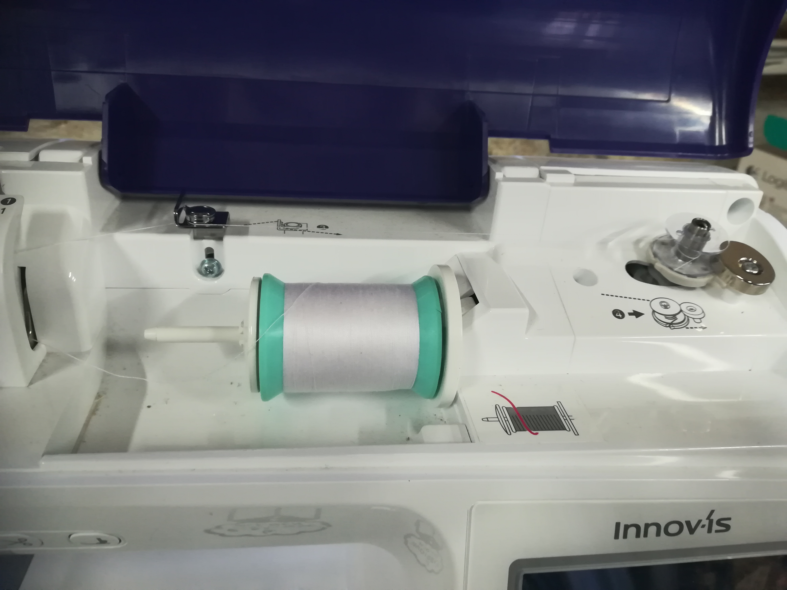
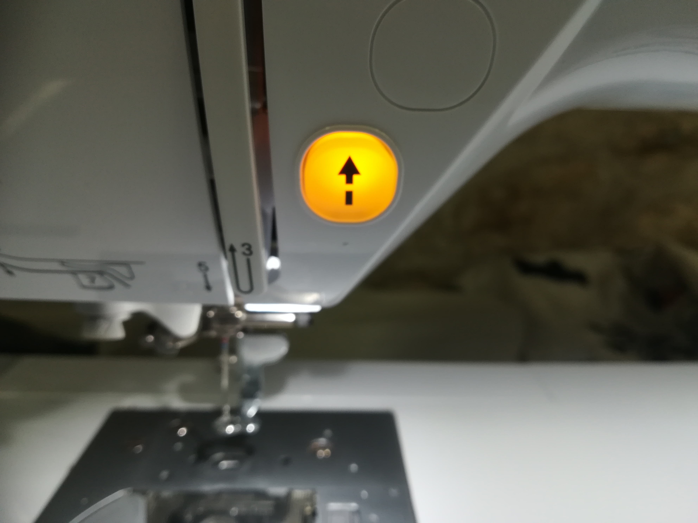

# Brodeuse - Que faire si la cannette est vide ?

Si jamais la canette est vide, pas de panique, commencez par ouvrir la trappe dans laquelle elle se trouve.

retirez la canette, mettez la sur le support de bobinage et enclenchez ce dernier.

Prenez le fil de canette (grosse bobine blanche), placez le sur le support de fil et suivez les flèches en pointillé partant vers la canette. Enroulez un peu du fil autour de la canette

Il ne vous reste plus qu’à appuyer sur le bouton de bobinage, éclairée en orange.
ATTENTION la machine ne s’arrête pas automatiquement, il faut l’arrêter manuellement dès que le rythme de bobinage ralentit.

