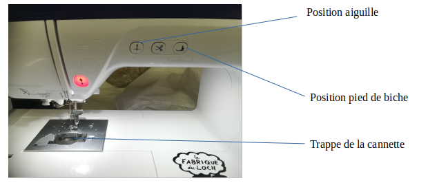
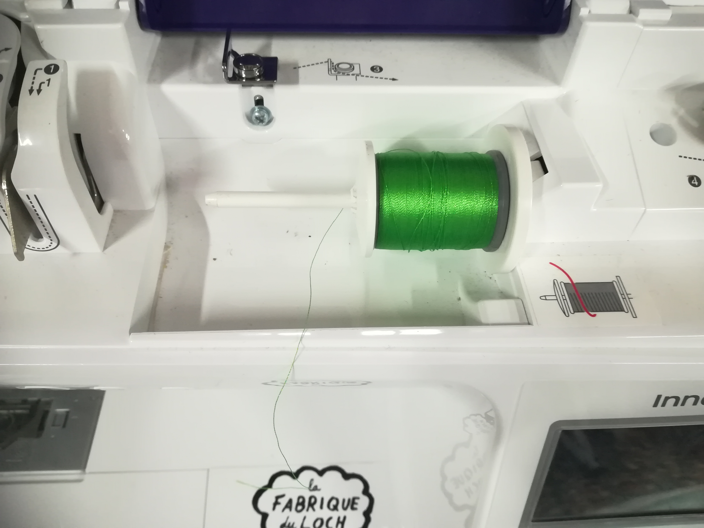
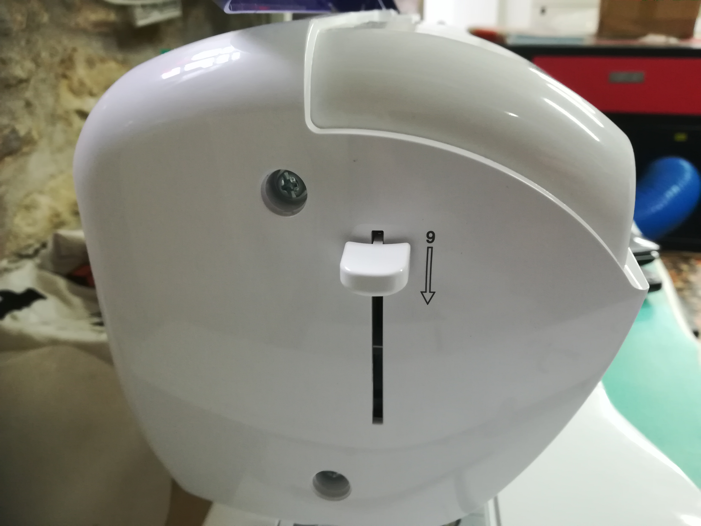

# Brodeuse - Mise en place du fil

Commencez par mettre la machine sous tension à l’aide du bouton on/off situé sur sa droite.
Elle affichera alors une annonce pour prévenir du déplacement du support de broderie, appuyez juste sur « **ok** » sur l’écran tactile et la machine sera prête à l’emploi.
**VÉRIFIEZ LE NIVEAU DE LA CANNETTE !
Pour se faire, regardez dans la trappe située au milieu de la machine, vous y verrez une petite bobine, il s’agit de la cannette.
Si jamais cette dernière se vide pendant votre broderie, la machine arrêtera le travail en cours et vous vous verrez contraint de changer la bobine en cours de route.
Si jamais la canette est vide, ou trop peu remplie pour faire tout votre travail, référez-vous à la section 1.3 : que faire si la cannette est vide ?**
Assurez-vous que le pied-de-biche et l’aiguille soient relevés, si ce n’est pas le cas ,vous pouvez  y remédier à l’aide des boutons « **position aiguille** » et « Position pied-de-biche » (ou du levier à l’arrière de la machine).

mettez la bobine de fil sur le porte bobine, pensez à le coincer entre les deux disques de maintien.

une fois ceci fait , il ne vous reste plus qu’à faire passer le fil en suivant les nombres et les **flèches pleines** pour les étapes 1 à 8.
pour l’étape 6, pensez à bien coincer le fil dans le **guide-fil.**

Enfin, abaissez le levier se situant à la gauche de la machine pour passer le fil dans l’aiguille. Il ne faut pas hésiter à y mettre un peu de force, sans y aller comme un bourrin pour autant,

