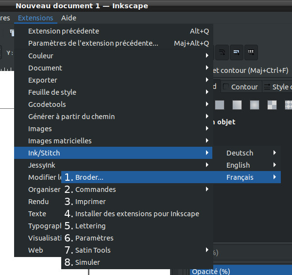
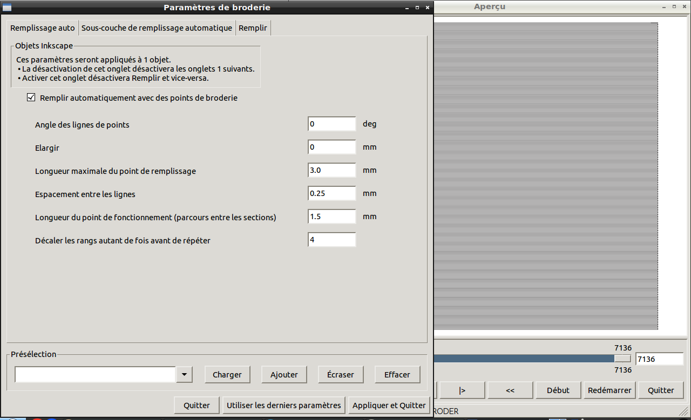

# Brodeuse - Préparer son motif

Nous allons partir d’un motif que vous avez fait vous même ou récupérer d’internet.

Tout d’abord, importez votre motif dans Inkscape

Vectorisez-le (**clic droit → vectoriser un objet matriciel**)

Assurez-vous d’en faire un chemin (**Ctrl+Maj+c OU chemin → objet en chemin**) afin que le logiciel soit capable de le convertir en  broderie et, si besoin, simplifiez-le (**Ctrl+l**) une ou deux fois afin d’éviter une broderie inutilement complexe (note : dans certains cas, un motif trop complexe engendrera tout simplement un refus de conversion de la part du plugin Inkstitch)

Une fois votre forme de base préparée, il est temps de faire les réglages de la broderie.
Pour ce faire, allez dans **Extension → Ink/Stitch → français** où vous trouverez les options suivantes

1. Broder… : exporte votre fichier de broderie
2. commandes : donne accès à différentes commandes de brodeuse comme couper le fil ou ignorer un élément
3. imprimer : préparer un aperçu pour faire notamment un bon de commande, avoir une estimation du temps de travail
4. lettering : permet de faire un lettrage basique (encore en développement)
5. installer des extensions pour inkscape : à permis l’installation de la palette brother
6. paramètres : permet de configurer la broderie pour obtenir le résultat souhaité
7. Satin Tools : permet de gérer les broderies de type satin à partir de lignes simple (encore en développement)

Ink/Stitch détecte automatiquement le type de travail recherché en fonction des éléments de votre forme (par exemple un fond est un remplissage par défaut) et les ordonne de la couche inférieure vers la couche supérieure.

Pour avoir les réglages qui vous conviennent, sélectionnez votre forme puis allez dans
Extension → ink/stitch → français → paramètres
Vous vous retrouverez alors face au menu suivant :  

{: width="800px"}

Comme vous pouvez le voir, ce menu offre également un aperçu « en temps réel » vous permettant ainsi de faire des essais sur les différents paramètres proposés et d’avoir une idée approximative du résultat final.
