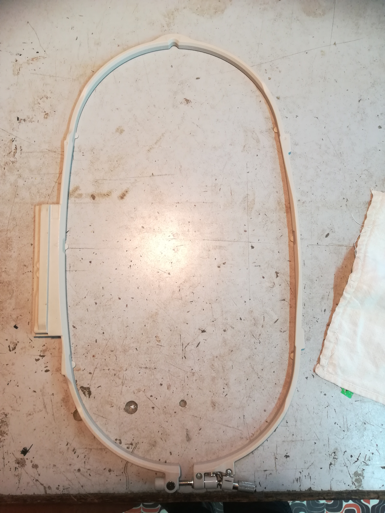
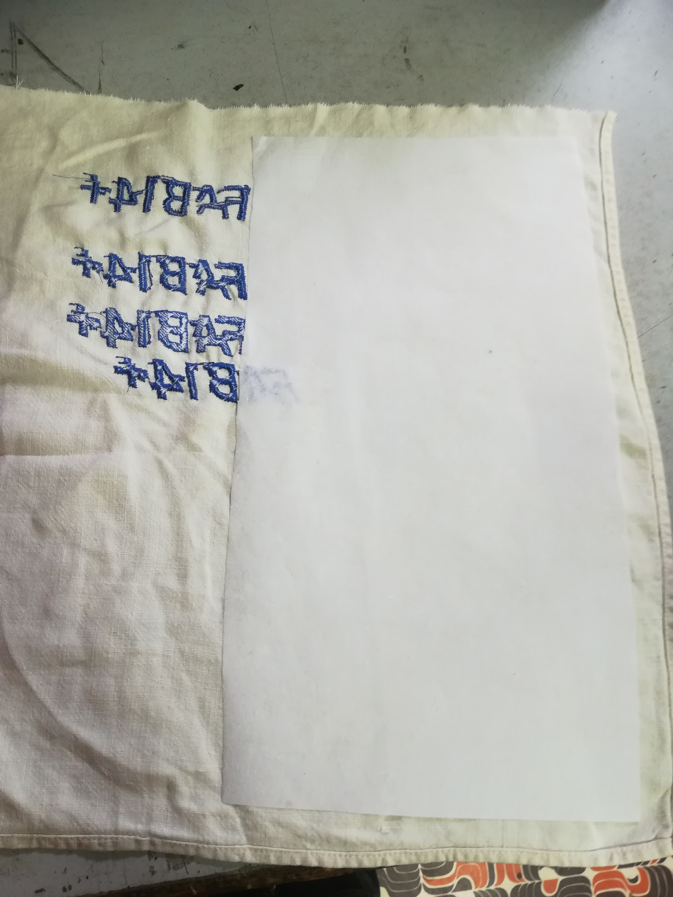
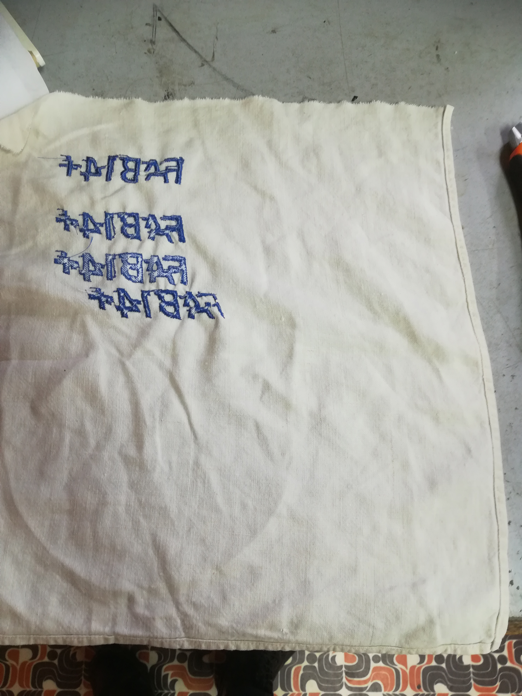
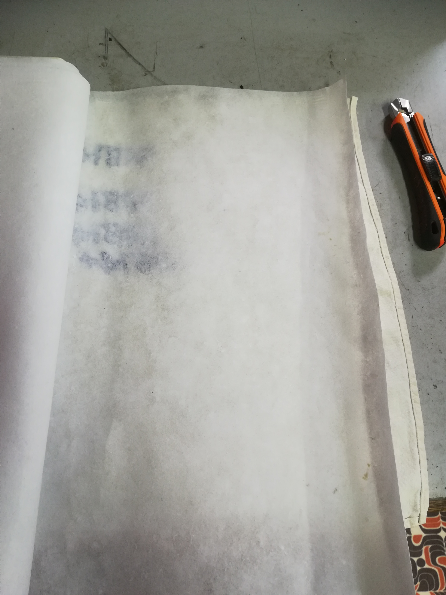
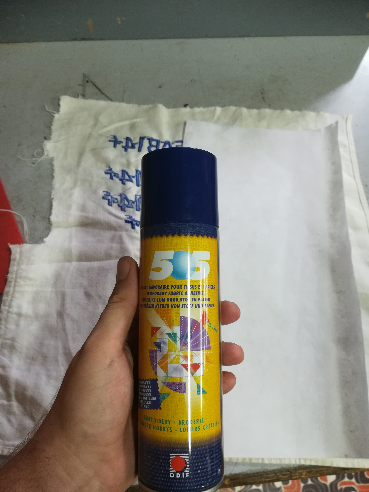
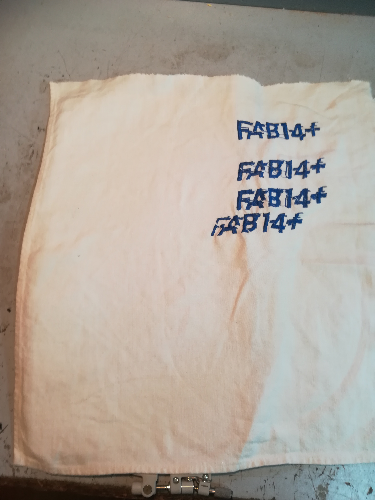
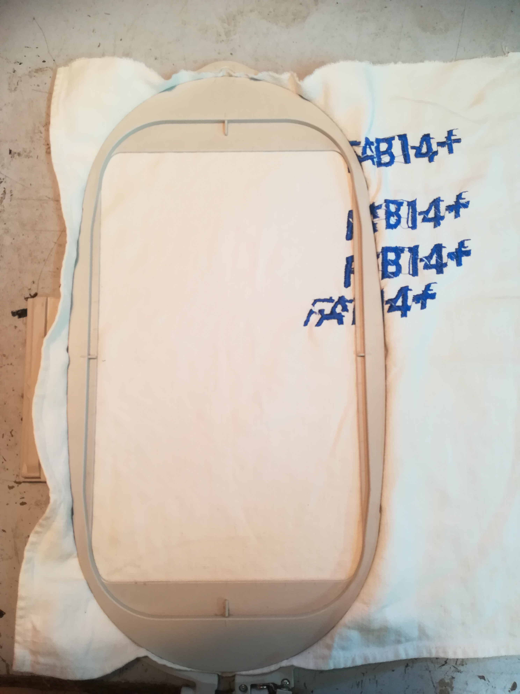
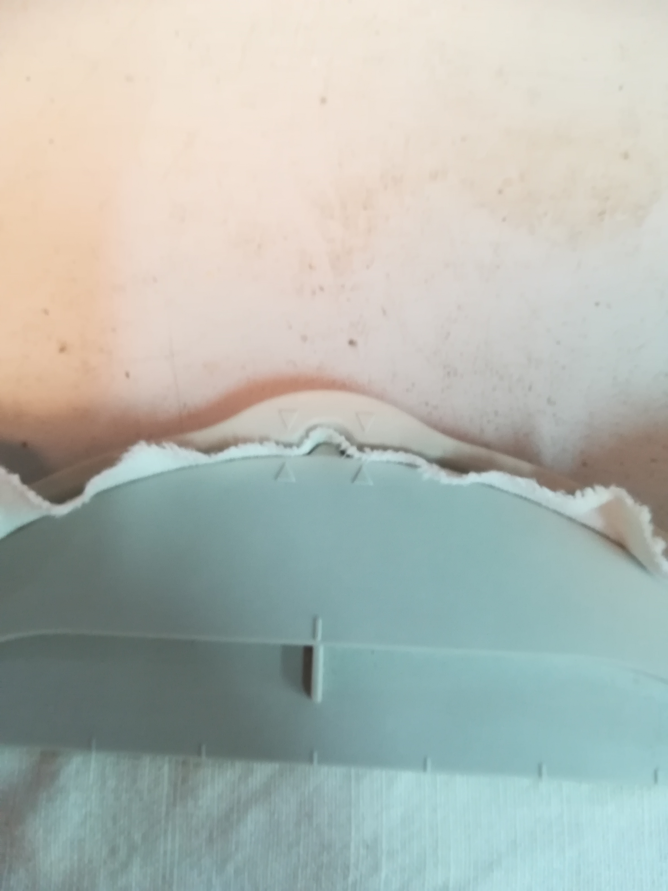
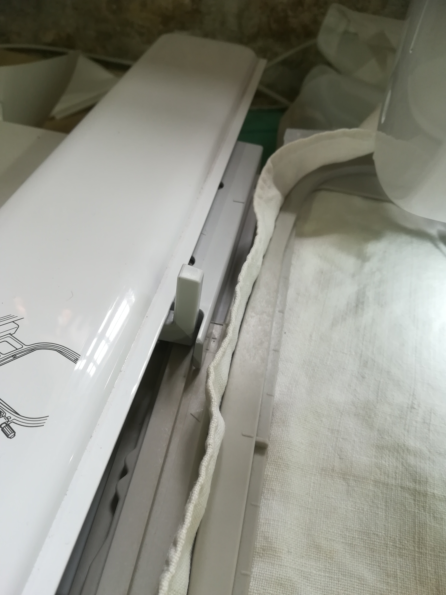

# Brodeuse - Préparation du tissu

prenez votre support de broderie (le grande à une surface de 260x160mm et le petit, une surface de 100x100mm) les supports sont en deux parties, une inférieure (avec vis) et une supérieure.

découpez votre surface de renfort

Prenez un tissu à un format qui vous convient, il doit au moins être un peu plus grand que votre support

Prenez le renfort et voyez ce dont vous avez besoin. Vous n’avez besoin de couvrir qu’une surface légèrement supérieure au motif que vous souhaitez broder

mettez **un peu** de spray adhésif sur le renfort et collez le au tissu

placez votre tissu sur le cadre inférieur de votre support (la partie avec des vis de serrage)

posez le cadre supérieur du support et alignez les flèches des deux cadres afin de **bien coincer le tissu.**

Serrez le cadre et assurez vous que le tissu soit **bien tendu**

Vous pouvez maintenant glisser le support dans la partie prévue à cet effet sur la machine pour se faire, levez le levier, glissez la tige du cadre de broderie et abaissez le levier.

