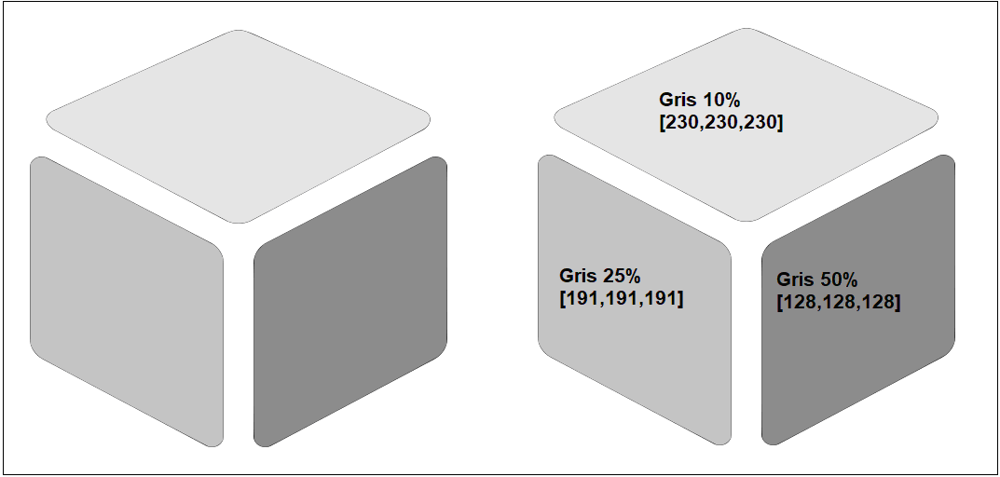
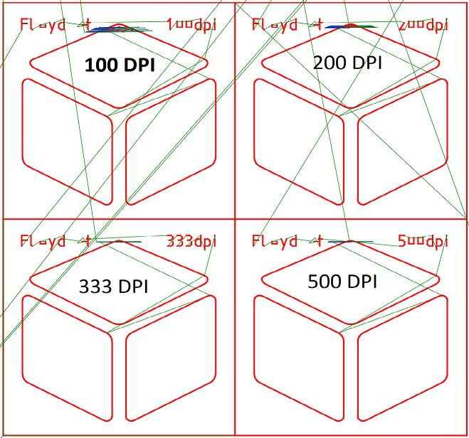
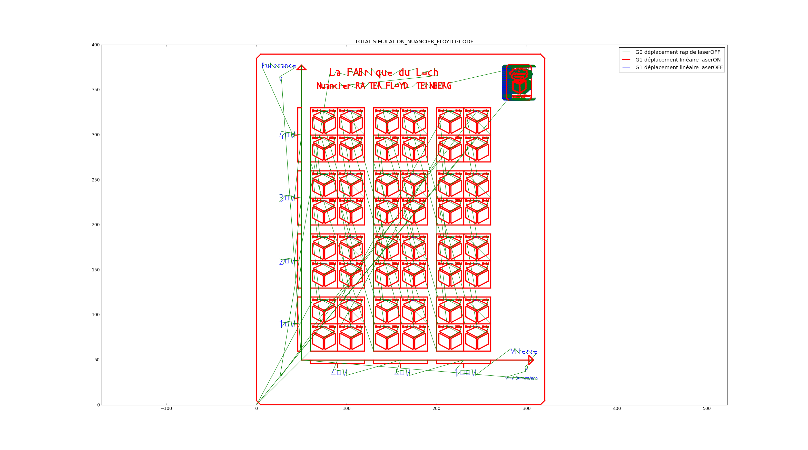

# NUANCIER RASTER FLOYD-STEINBERG

- [Nuancier Raster Floyd-Steinberg](https://www.lafabriqueduloch.org/projet/nuancier-raster-floyd-steinberg/)
- [Nuancier Raster 3D](https://www.lafabriqueduloch.org/projet/nuancier-raster3d/)
- [Nuancier focale](https://www.lafabriqueduloch.org/projet/nuancier-focale/"https://www.lafabriqueduloch.org/projet/nuancier-focale/)

- Dimensions :	320mm X 390mm
- Vitesses :	 60%, 80% , 100%
- Puissances :	10%, 20%, 30%, 40%

Pour chaque choix (Vitesse,Puissance) sont gravés :
un motif CUBE à 3 faces, colorées respectivement :
- en GRIS 10% [RGB=(230,230,230)]
- en GRIS 25% [RGB=(191,191,191)]
- en GRIS 50% [RGB=(128,128,128)]
en 4 résolutions : 100dpi, 200dpi, 333dpi et 500dpi

Nuancier RASTER Floyd-Steinberg :
- En abscisses Vitesse=[60,80,100] %
- En ordonnées Puissance=[10,20,30,40] %

Visuel du motif :

Pour chaque couple (Puissance,Vitesse), on grave en RASTER selon 4 résolutions :

Simulation du nuancier :
{: width="500px"}
