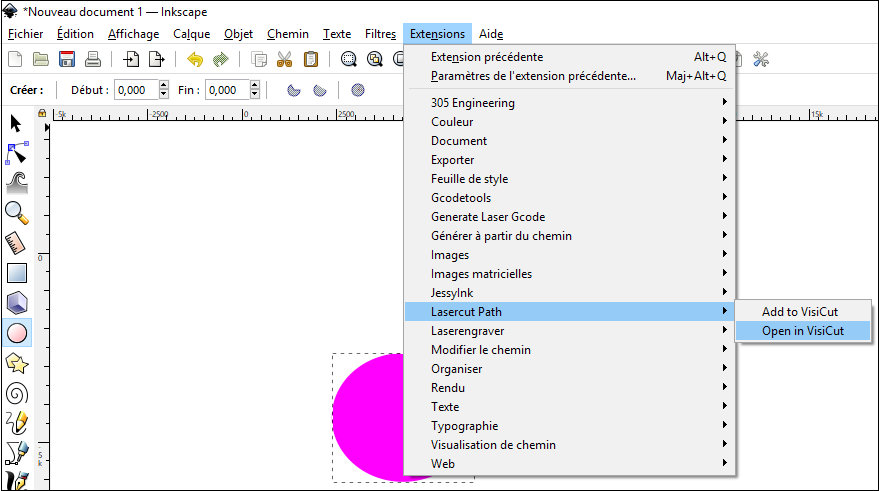

# Etape 1: Editer son fichier .svg avec Inkscape
On se référera au contenu de la formation proposée à la FABrique.

Inkscape est utilisé pour créer le dessin vectoriel qui sera envoyé à la découpeuse laser.

Les fichiers sont au format .SVG.

## Avec des fichiers provenant d'autres logiciels
Attention toutefois lorsque le fichier .SVG d'origine a été créé avec d'autres logiciels notamment Illustrator.
Il peut y avoir un problème d'échelle.

Pour redimensionner les SVG Illustrator d’un facteur 125% dans Inkscape:

1. Ouvrir le .SVG créé par Illustrator dans Inkscape
2. Tout sélectionner (Ctrl+A), grouper (Ctrl+G).
3. Dans le menu objet, transformer (Ctrl+Maj+M)
4. Dans la nouvelle fenêtre, onglet mise a l’échelle : 125% (largeur et hauteur)
5. Vérifier que les dimensions sont maintenant correctes.

[Pour en savoir plus](inkscape-resolution)

## Envoi du .SVG vers Visicut

Une fois le dessin terminé, l’ouvrir avec Visicut permettra de générer le G-CODE correspondant à la découpe/gravure Laser que l’on souhaite.
- Sélectionner l’objet à découper ou à graver.
- Menu Extension, LasercutPath, Open in Visicut

{: width="500px"}
