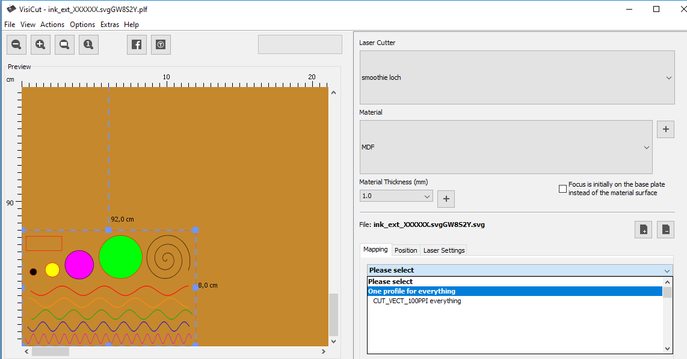
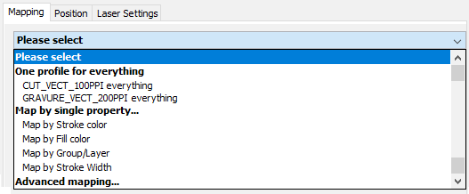

### Mapping objets – profils laser
Cette étape va permettre de partitionner les objets contenus dans le dessin vectoriel, et de leur associer une action à réaliser.

#### Fichier .SVG dans Inkscape

#### Ouverture dans Visicut

#### Onglet Mapping
{: width="500px"}

- One profile for everything : le même profil laser pour tous les objets
- Map by single property : on partitionne les objets pour les regrouper selon leurs caractéristiques, et affecter un profil laser spécifique
- Stroke color : couleur du contours. Par exemple, découpe laser pour le rouge, marquage pour le bleu etc…
  - Fill color : couleur de remplissage
  - Layer : par calque
  - Stroke width : épaisseur de contours
- Advanced mapping : utilisation avancée.
