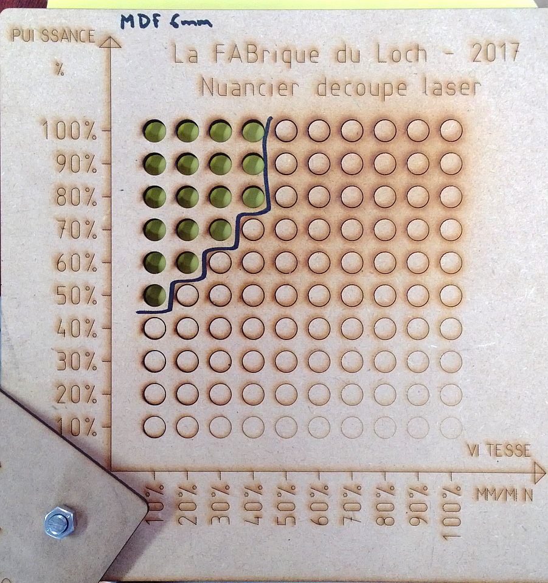

# Nuancier pour la découpe/gravure vectorielle

En fonction du matériau, on peut choisir un couple (Puissance,Vitesse) du laser approprié. Le nuancier permet de simuler la découpe d’un disque de diamètre 10mm pour plusieurs choix de Puissance et de Vitesse :

[Nuancier découpe vitesse puissance](https://www.lafabriqueduloch.org/projet/nuancier-decoupe-vitesse-puissance/)
