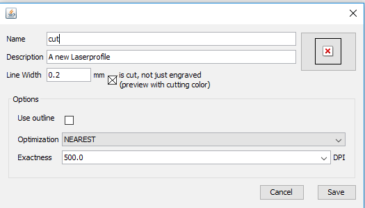
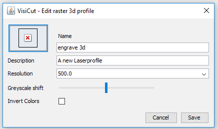

# Profils laser

Cette étape va permettre de partitionner les objets contenus dans le dessin vectoriel, et de leur associer une action à réaliser.

Trois types de profils peuvent être créés dans Visicut (menu Options>Profiles):
- Line profile
- Raster profile
- Raster 3D profile

## Line profile
Usage : découpe (cut) et gravure vectorielle (marquage – mark)

### Options découpe
résolution (dpi) : nombre de points par inch (25.4mm). Par exemple, à 100dpi, deux points consécutifs seront distants au minimum de 25.4/100=0.254mm. Cette résolution agit aussi sur le nombre de côté du polygone utilisé pour approximer un cercle ou une courbe.

épaisseur de trait représentée (si on veut découper un trait plus large, il fera plusieurs passages afin de couvrir l’épaisseur)
Optimization : du chemin parcouru par la tête laser (nearest conseillé).

## Options marquage
Identiques à ceci près que l’on décoche « is cut… , not just engraved »

### Raster profile
Usage : gravure RASTER point par point (« aplat ») des images noir et blanc

Chaque face de chaque cube est gravé en raster Floyd-Steinberg.

## Options RASTER

### résolution (dpi)
Nombre de points par inch (25.4mm).

Cette résolution agit sur le nombre de points (blancs et noirs) qui formeront le nuage représentant la surface colorée.

- Trop faible : points isolés.
- Trop forte : les points noirs, tellement rapprochés, se brûlent les uns les autres.

Par exemple, à 100dpi, deux points consécutifs seront distants au minimum de 25.4/100=0.254mm.

### Dithering Algorithm
Floyd-Steinberg (recommandé), HalfTone.

### Grayscale Shift
Curseur non gradué permettant de décaler les valeurs.

Imaginons un carré gris à 50%, sa valeur de gris vaut donc 128. Si on lance un algorithme de dithering, on va créé un nuage de pixels dont un point sur 2 sera noir.

Le curseur permet de moduler ceci en ajoutant une valeur au gris rencontré dans l’image. Curseur à gauche : on ajoute (-255) et curseur à droite +255.

Ainsi, si on décale le curseur à droite d’un quart (+64), la valeur du gris à coder deviendra 128+64=192 : gris beaucoup plus clair, donc nuage plus clairsemé de points noirs.

Si on décale le curseur à fond à droite, on obtient 128+255=383, plafonné à 255, soit blanc, et l’algorithme ne créera aucun point noir. Réglage assez sensible (+255 est possible, car alors le noir , initialement 0, sera transformé en 0+255 : blanc).

### Raster 3D profile
Usage : gravure RASTER3D point par point (« aplat ») des images gris

### Options RASTER 3D:
résolution (dpi) : nombre de points par inch (25.4mm). Par exemple, à 100dpi, deux points consécutifs seront distants au minimum de 25.4/100=0.254mm. Cette résolution agit sur le nombre de points gris qui formeront le nuage représentant la surface colorée. Trop faible : points isolés. Trop forte : les points, tellement rapprochés, peuvent se brûlent les uns les autres et donc rendre l’image trop foncée
Grayscale shift : là encore possibilité de moduler la noirceur (curseur -255 à 255).

Format de fichier .PLF
Le format .SVG ne contient que les objets vectoriels, et rien concernant les profils laser associés. Pour garder trace des associations objets-profils, il faut enregistrer sous dans Visicut. On crée ainsi un nom de fichier COURBURE.PLF.

Il s’agit d’un format compressé (on peut l’ouvrir et le décompresser avec 7-zip…), encapsulant 3 éléments :
Le fichier .SVG initial (sans correspondance de profils)
Un fichier transform.xml décrivant les transformations géométriques effectuées sous Visicut (placement, redimensionnement).
Un fichier mappings.xml décrivant la table des correspondances objets et profils laser tels qu’ils ont été définis dans l’onglet Mapping

En réouvrant ce .PLF avec Visicut à l’avenir, ces 3 fichiers permettront à Visicut de rouvrir le .SVG, le redimensionner et le replacer sur la table de travail, et d’associer aux objets les profils laser. En revanche, si on réouvre le .SVG (dans Inkscape>Extension>LaserCut PAth>Open in Visicut) il faut tout refaire…

Remarque : en revanche, aucune information concernant Vitesse et Puissance Laser n’ont été enregistrées. Les valeurs par défaut des profils laser utilisés seront reprises. Ce choix est délibéré, les auteurs considérant que le fichier .PLF devait être indépendant de tout matériel ; le choix puissance/laser dépendant de la machine et du matériau à découper, cela est cohérent. Il faudra donc redéfinir à chaque réouverture ces paramètres.
