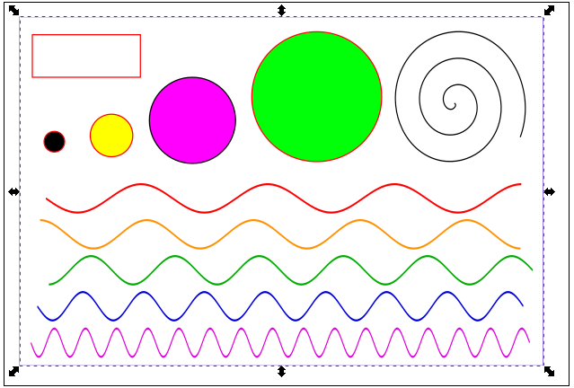

# CHOIX DE LA RÉSOLUTION POUR LA DÉCOUPE/GRAVURE VECTRIELLE DE COURBES

Le nuancier DPI représente la gravure des motifs suivants pour les résolutions 100, 150, 200, 333, 500, 1000 dpi. Plus les lignes sont droites, et moins il est besoin de recourir à des résolutions élevées.

- [Nuancier découpe vitesse x dpi](https://www.lafabriqueduloch.org/projet/nuancier-decoupe-vitesse-dpi/)

- [Nuancier Floyd-Steinberg](floydsteinberg)
