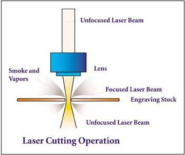
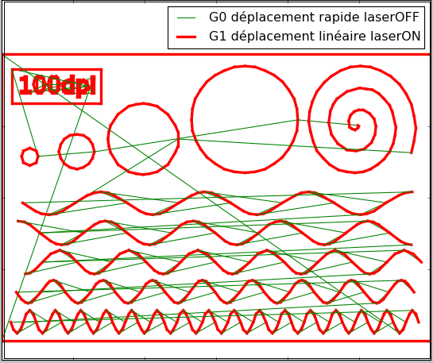
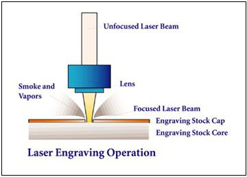
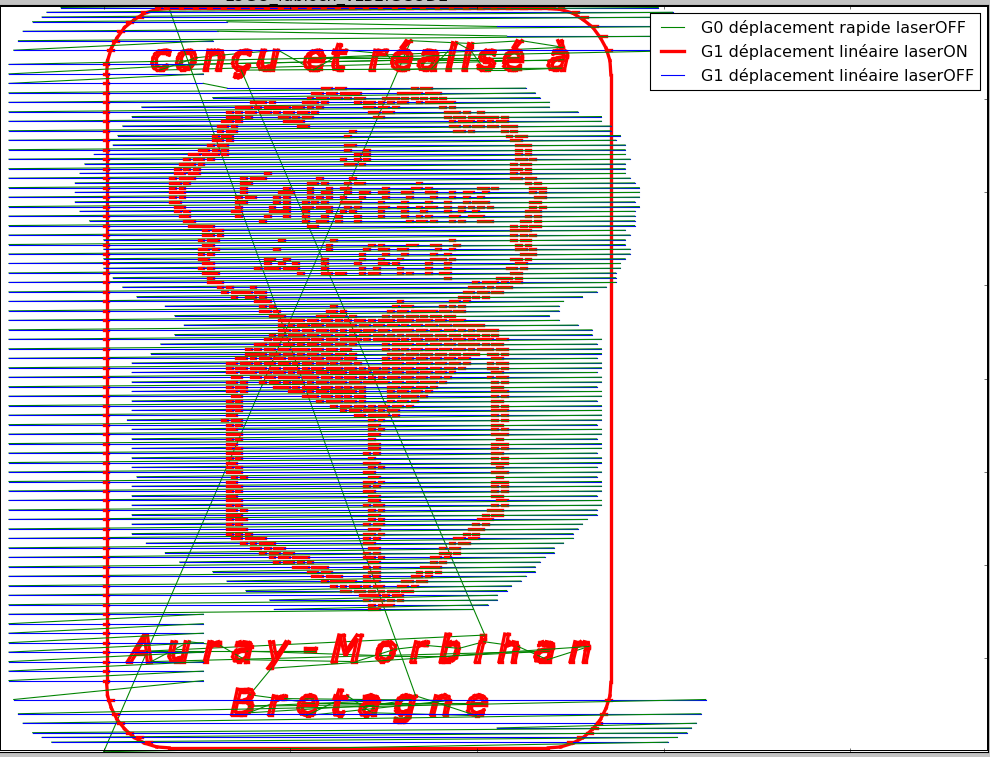
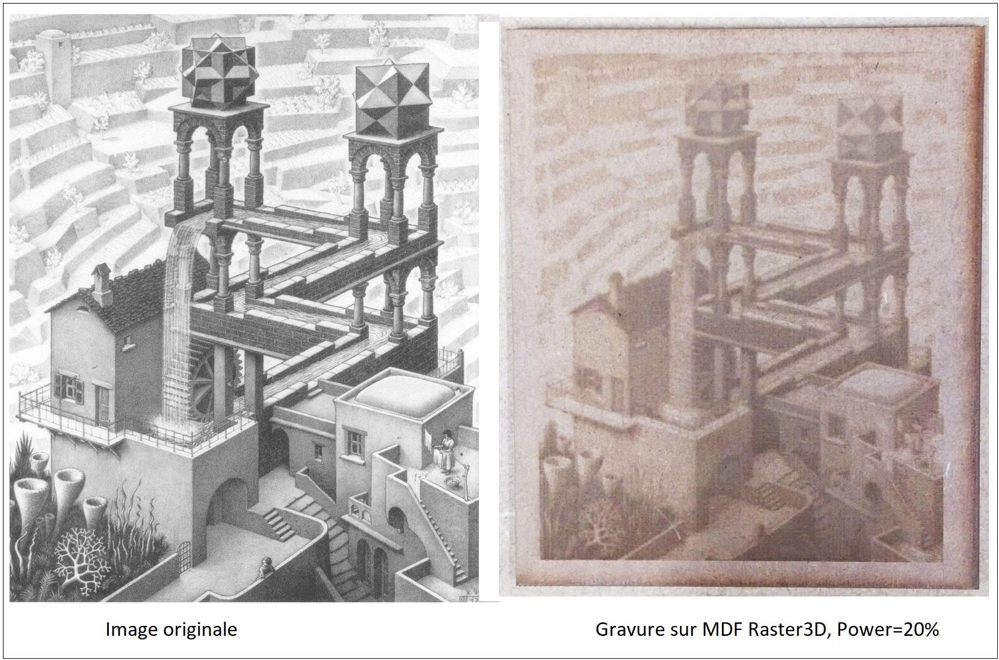

## Usages
[Usages découpe laser/](https://www.lafabriqueduloch.org/projet/usages-decoupe-laser/)

### La découpe vectorielle (cutting)
Le laser se déplace le long d’une ligne (courbe) relativement lentement, à puissance conséquente, ce qui a pour effet de découper le long du chemin.  Pour graver plusieurs motifs, les seuls déplacements non efficaces sont donc ceux permettant de passer d’un motif à un autre, laser OFF (et peu nombreux).

{: height="303px"}

### La gravure vectorielle (marking)
Même principe que pour la découpe vectorielle, mais à des puissances plus faibles et des vitesses plus rapides, ne permettant pas au laser de découper la totalité de l‘épaisseur du matériau, mais seulement d’en retirer une partie : le contour est ainsi gravé.

[Source](http://rowmark.com/MARK/laser_guide/pages/intro.asp)

### Gravure RASTER (aplat - engraving)

A partir d’une image, ce procédé permet :
1. De **transformer les couleurs de l’image en nuages de points** noirs et de points blancs, dont la densité rend compte de la couleur (vu « de loin », l’espacement des points noirs donne une impression de nuance de gris). Plusieurs algorithmes sont envisageables (Floyd-Steinberg, Half Tone,  dithering…).
2. Le laser parcourt l’ensemble des pixels de l’image ainsi transformée, et brûle les pixels noirs en laissant intact les blancs. Il est à noter que tous les pixels noirs sont brûlés avec la même puissance dans ce mode RASTER. C’est uniquement leur espacement qui rendra compte d’une nuance de gris.

{: width="600px"}

Sur cet exemple, le contour, les textes « conçu et réalisé à » et « Auray-Morbihan Bretagne » sont gravés en vectoriel, et le logo en raster. On voit la couverture de la zone à traitée, qu’il y ait des pixels à graver (noir) ou non (blanc). Ce procédé est coûteux en temps.

### Gravure Raster 3D (3D engraving)
Cette fois, l’image couleur est convertie en nuances de gris, et les pixels noirs seront gravés avec une puissance 100%, les blancs avec une puissance nulle, et les nuances de gris avec une puissance qui lui est proportionnelle. La puissance du laser est donc modulée en fonction de la valeur du pixel au-dessus duquel il se trouve, permettant de graver plus ou moins profondément le matériau, d’où une gravure RASTER 3D.

{: width="600px"}
