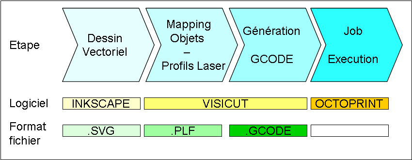

# Le mode d'emploi de la découpeuse laser

## Inkcape
- Etape 1: [Editer son fichier .svg avec Inkscape](inkscape.md)

## Visicut

[Visicut pour la découpe laser](https://www.lafabriqueduloch.org/projet/visicut-decoupe-laser/)

Visicut permet d’associer aux éléments du dessin vectoriel (fichier .SVG) un ensemble d’actions (découpe, marquage ou gravure). La chaîne est la suivante :

- Etape 2: [Mapper les objets avec Visicut](mapping)
- Etape 3: [Définir les profils laser pour les objets](profiles)
- Etape 3 bis: [Définition des paramètres Vitesse / Puissance du laser](vitesse-puissance)
- Etape 4: [Générer le gcode avec Visicut](gcode)

## Octoprint
- Etape 5: [Contrôler la progression du travail](octoprint)
