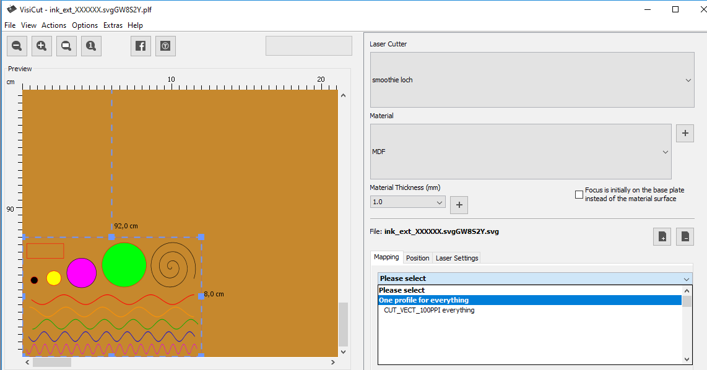
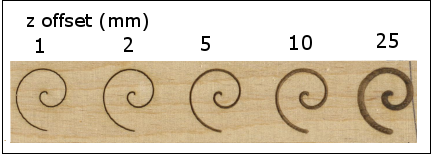

## INKSCAPE ET FICHIER .SVG
On se référera au contenu de la formation proposée à la FABrique.

### Problème d'échelle entre illustrator et Inkscape
Format .SVG Illustrator et .SVG Inkscape
Les fichiers .SVG sont sauvegardés avec des unités en pixels, cependant inkscape et illustrator utilisent des facteurs de conversion px/mm différents :
- Illustrator 	72dpi : 72 px = 1 inch = 25.4 mm
- Inkscape 	90dpi : 90 px = 1 inch = 25.4 mm

#### Exemple
Supposons avoir créé un carré de côté 25.4mm dans Illustrator.
Lorsque vous enregistrez le fichier .SVG avec Illustrator, les dimensions sont converties en pixels avec le ratio 72dpi : on a donc un carré de côté 72 pixels.
En l’ouvrant dans inkscape (export .svg), il ouvre un fichier contenant un carré de 72 pixels, en utilisant un ratio de 90dpi pour retrouver les dimensions de l’objet. On obtient donc un carré de côté 72px/90dpi = 0.8 inch = 20.32mm.

Il est donc nécessaire dans Inkscape de redimensionner les objets créés avec Illustrator d’un facteur de 90/72 = 125% afin de conserver les dimensions originales (en mm).
Redimensionner les SVG Illustrator d’un facteur 125% dans Inkscape
ouvrir le .SVG créé par Illustrator dans Inkscape
tout sélectionner (Ctrl+A), grouper (Ctrl+G).
dans le menu objet, transformer (Ctrl+Maj+M)
dans la nouvelle fenêtre, onglet mise a l’échelle : 125% (largeur et hauteur)
vérifier que les dimensions sont maintenant correctes.

## Envoi du .SVG vers Visicut
Une fois le dessin terminé, l’ouvrir avec Visicut permettra de générer le G-CODE correspondant à la découpe/gravure Laser que l’on souhaite.
- Sélectionner l’objet à découper ou à graver.
- Menu Extension, LasercutPath, Open in Visicut

{: width="500px"}

## Visicut

[Visicut pour la découpe laser](https://www.lafabriqueduloch.org/projet/visicut-decoupe-laser/)

Visicut permet d’associer aux éléments du dessin vectoriel (fichier .SVG) un ensemble d’actions (découpe, marquage ou gravure). La chaîne est la suivante :


Mapping objets – profils laser
Cette étape va permettre de partitionner les objets contenus dans le dessin vectoriel, et de leur associer une action à réaliser.

Fichier .SVG dans Inkscape


Ouverture dans Visicut



Onglet Mapping
{: width="500px"}

- One profile for everything : le même profil laser pour tous les objets
- Map by single property : on partitionne les objets pour les regrouper selon leurs caractéristiques, et affecter un profil laser spécifique
Stroke color : couleur du contours. Par exemple, découpe laser pour le rouge, marquage pour le bleu etc…
  - Fill color : couleur de remplissage
  - Layer : par calque
  - Stroke width : épaisseur de contours
- Advanced mapping : utilisation avancée.

#### Profils laser

Cette étape va permettre de partitionner les objets contenus dans le dessin vectoriel, et de leur associer une action à réaliser.
		Trois types de profils peuvent être créés dans Visicut (menu Options>Profiles)

- Line profile
- Raster profile
- Raster 3D profile


#### Line profile
Usage : découpe (cut) et gravure vectorielle (marquage – mark)


#### Options découpe :
résolution (dpi) : nombre de points par inch (25.4mm). Par exemple, à 100dpi, deux points consécutifs seront distants au minimum de 25.4/100=0.254mm. Cette résolution agit aussi sur le nombre de côté du polygone utilisé pour approximer un cercle ou une courbe.

épaisseur de trait représentée (si on veut découper un trait plus large, il fera plusieurs passages afin de couvrir l’épaisseur)
Optimization : du chemin parcouru par la tête laser (nearest conseillé).


#### Options marquage :
Identiques à ceci près que l’on décoche « is cut… , not just engraved »


## Raster profile
Usage : gravure RASTER point par point (« aplat ») des images noir et blanc


Chaque face de chaque cube est gravé en raster Floyd-Steinberg.


### Options RASTER :
résolution (dpi) : nombre de points par inch (25.4mm). Par exemple, à 100dpi, deux points consécutifs seront distants au minimum de 25.4/100=0.254mm. Cette résolution agit sur le nombre de points (blancs et noirs) qui formeront le nuage représentant la surface colorée. Trop faible : points isolés. Trop forte : les points noirs, tellement rapprochés, se brûlent les uns les autres.
Dithering Algorithm : Floyd-Steinberg (recommandé), HalfTone.
Grayscale Shift : curseur non gradué permettant de décaler les valeurs. Imaginons un carré gris à 50%, sa valeur de gris vaut donc 128. Si on lance un algorithme de dithering, on va créé un nuage de pixels dont un point sur 2 sera noir. Le curseur permet de moduler ceci en ajoutant une valeur au gris rencontré dans l’image. Curseur à gauche : on ajoute (-255) et curseur à droite +255. Ainsi, si on décale le curseur à droite d’un quart (+64), la valeur du gris à coder deviendra 128+64=192 : gris beaucoup plus clair, donc nuage plus clairsemé de points noirs. Si on décale le curseur à fond à droite, on obtient 128+255=383, plafonné à 255, soit blanc, et l’algorithme ne créera aucun point noir. Réglage assez sensible (+255 est possible, car alors le noir , initialement 0, sera transformé en 0+255 : blanc).


### Raster 3D profile
Usage : gravure RASTER3D point par point (« aplat ») des images gris


### Options RASTER 3D:
résolution (dpi) : nombre de points par inch (25.4mm). Par exemple, à 100dpi, deux points consécutifs seront distants au minimum de 25.4/100=0.254mm. Cette résolution agit sur le nombre de points gris qui formeront le nuage représentant la surface colorée. Trop faible : points isolés. Trop forte : les points, tellement rapprochés, peuvent se brûlent les uns les autres et donc rendre l’image trop foncée
Grayscale shift : là encore possibilité de moduler la noirceur (curseur -255 à 255).

Format de fichier .PLF
Le format .SVG ne contient que les objets vectoriels, et rien concernant les profils laser associés. Pour garder trace des associations objets-profils, il faut enregistrer sous dans Visicut. On crée ainsi un nom de fichier COURBURE.PLF.

Il s’agit d’un format compressé (on peut l’ouvrir et le décompresser avec 7-zip…), encapsulant 3 éléments :
Le fichier .SVG initial (sans correspondance de profils)
Un fichier transform.xml décrivant les transformations géométriques effectuées sous Visicut (placement, redimensionnement).
Un fichier mappings.xml décrivant la table des correspondances objets et profils laser tels qu’ils ont été définis dans l’onglet Mapping

En réouvrant ce .PLF avec Visicut à l’avenir, ces 3 fichiers permettront à Visicut de rouvrir le .SVG, le redimensionner et le replacer sur la table de travail, et d’associer aux objets les profils laser. En revanche, si on réouvre le .SVG (dans Inkscape>Extension>LaserCut PAth>Open in Visicut) il faut tout refaire…

Remarque : en revanche, aucune information concernant Vitesse et Puissance Laser n’ont été enregistrées. Les valeurs par défaut des profils laser utilisés seront reprises. Ce choix est délibéré, les auteurs considérant que le fichier .PLF devait être indépendant de tout matériel ; le choix puissance/laser dépendant de la machine et du matériau à découper, cela est cohérent. Il faudra donc redéfinir à chaque réouverture ces paramètres.


### Définition des paramètres Vitesse/Puissance du laser

#### Onglet Laser Settings


Une fois le mapping effectué, l’onglet Laser Settings fait apparaître l’ensemble des profils laser utilisés et la liste des couleurs auxquelles chaque profil est associé (on a choisi un mapping par stroke color ici).
On a la main sur 3 paramètres :
Power : puissance du laser [ 0 – 100 ] %
Speed : vitesse de déplacement laser actif [0 – 100] % (100% correspond à 3000mm/min)

#### Focus
décalage vertical (en Z) de la lentille. En théorie, vous avez réglé la hauteur de la lentille au-dessus du matériau de façon à respecter la focale de la lentille [à la FABrique du Loch, lentille de focale 2.5’’ = 63.5mm. De cette façon, le laser est focalisé de façon très précise sur le matériau. Lorsque l’on veut graver des matériaux épais, il peut être judicieux de focaliser le faisceau non pas en surface mais dans l’épaisseur. Il peut être aussi utile de défocaliser sciemment le faisceau pour graver des traits plus larges (en éloignant la lentille de la surface du matériau de quelques milimètres)…

**Remarque**
en pratique, la machine ne modifie pas l’altitude de la lentille mais la hauteur du plateau (bed). Actuellement, un problème d’alignement des paliers empêche tout réglage de la hauteur du plateau à la FABrique : ne pas utiliser ce paramètre pour générer le GCODE. En revanche, initialement, on peut volontairement régler la tête laser à une altitude différente de la distance focale.





**Remarque diamètre faisceau laser et résolution**

Supposons travailler avec une lentille de focale f=2.5’’=63.5mm. Alors la largeur du rayon laser focalisé vaut 0.007’’ : deux points voisins ne se toucheront pas s’ils sont distants de 0.007’’, ce qui entraîne une résolution maximale de 1/0.007=142dpi… Au-delà on risque de surbrûler. Vouloir graver en RASTER 1000dpi semble totalement illusoire. En pratique, si on prend un rayon de 0.005’’, cela conduit à une résolution maximale de 1/0.005 = 200 dpi ce qui semble être une valeur plafond.


Source: http://www.engraversnetwork.com

Ces paramétrages ne sont pas enregistrables par Visicut (le format .PLF ne les contient pas).

### Format de fichier .GCODE

Une fois le mapping effectué, et les paramètres laser choisis, on peut générer le fichier G-CODE correspondant au travail à effectuer. Ce fichier contiendra toutes les opérations élémentaires à effectuer par la machine (liste de tous les déplacements, des puissances/vitesses/focus laser successifs).

```
Menu File>Export laser code.
```

### Octoprint

Ouvrir un navigateur et entrer l’adresse IP : 102.168.1.41, découpe laser en marche. L’interface Octoprint s’ouvre alors et se connecte à la machine.

Cette interface permet de :
- Uploader le fichier G-CODE dans la machine
- Estimer le temps d’exécution
- Lancer le job (on suppose que le matériau est en place, la lentille positionnée au zéro du fichier, le focus réglé en fonction de la focale de la lentille.
- Contrôler le déroulement grâce à la vue caméra.


