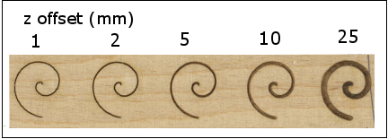
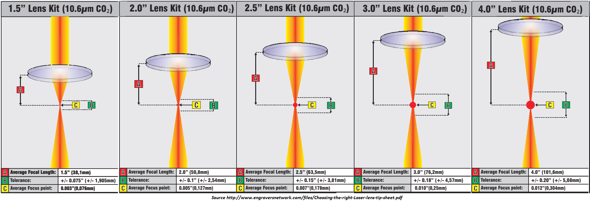
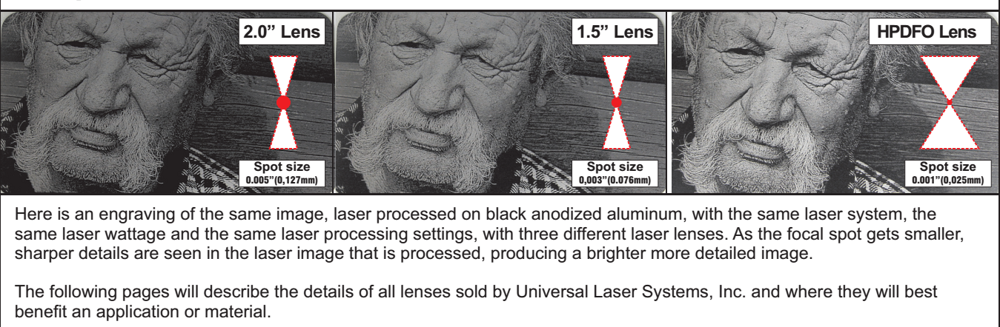

# Définition des paramètres Vitesse/Puissance du laser

## Onglet Laser Settings

Une fois le mapping effectué, l’onglet Laser Settings fait apparaître l’ensemble des profils laser utilisés et la liste des couleurs auxquelles chaque profil est associé (on a choisi un mapping par stroke color ici).

On a la main sur 3 paramètres :

### Power 
puissance du laser [ 0 – 100 ] %

### Speed
vitesse de déplacement laser actif [0 – 100] % (100% correspond à 3000mm/min)

### Focus
décalage vertical (en Z) de la lentille. En théorie, vous avez réglé la hauteur de la lentille au-dessus du matériau de façon à respecter la focale de la lentille [à la FABrique du Loch, lentille de focale 2.5’’ = 63.5mm. De cette façon, le laser est focalisé de façon très précise sur le matériau. Lorsque l’on veut graver des matériaux épais, il peut être judicieux de focaliser le faisceau non pas en surface mais dans l’épaisseur. Il peut être aussi utile de défocaliser sciemment le faisceau pour graver des traits plus larges (en éloignant la lentille de la surface du matériau de quelques milimètres)…

**Remarque**
en pratique, la machine ne modifie pas l’altitude de la lentille mais la hauteur du plateau (bed). Actuellement, un problème d’alignement des paliers empêche tout réglage de la hauteur du plateau à la FABrique : ne pas utiliser ce paramètre pour générer le GCODE. En revanche, initialement, on peut volontairement régler la tête laser à une altitude différente de la distance focale.

|--------|--------|-----------|------------|
| Focale | Focale | Spot size | Resolution |
| (inch) |  (mm)  |  (inch)   | max (dpi)  |
|--------|--------|-----------|------------|
|   1.5  |  38.1  |  0.003    |    333     |
|--------|--------|-----------|------------|
|   2    |  50.8  |  0.005    |    200     |
|--------|--------|-----------|------------|
|   2.5  |  63.5  |  0.007    |    143     |
|--------|--------|-----------|------------|
|   3    |  76.5  |  0.01     |    100     |
|--------|--------|-----------|------------|
|   4    | 101.6  |  0.012    |     83     |
|--------|--------|-----------|------------|

{: width="800px"}

**Remarque diamètre faisceau laser et résolution**

Supposons travailler avec une lentille de focale f=2.5’’=63.5mm. Alors la largeur du rayon laser focalisé vaut 0.007’’ : deux points voisins ne se toucheront pas s’ils sont distants de 0.007’’, ce qui entraîne une résolution maximale de 1/0.007=142dpi… Au-delà on risque de surbrûler. Vouloir graver en RASTER 1000dpi semble totalement illusoire. En pratique, si on prend un rayon de 0.005’’, cela conduit à une résolution maximale de 1/0.005 = 200 dpi ce qui semble être une valeur plafond.

Source: http://www.engraversnetwork.com

Ces paramétrages ne sont pas enregistrables par Visicut (le format .PLF ne les contient pas).
