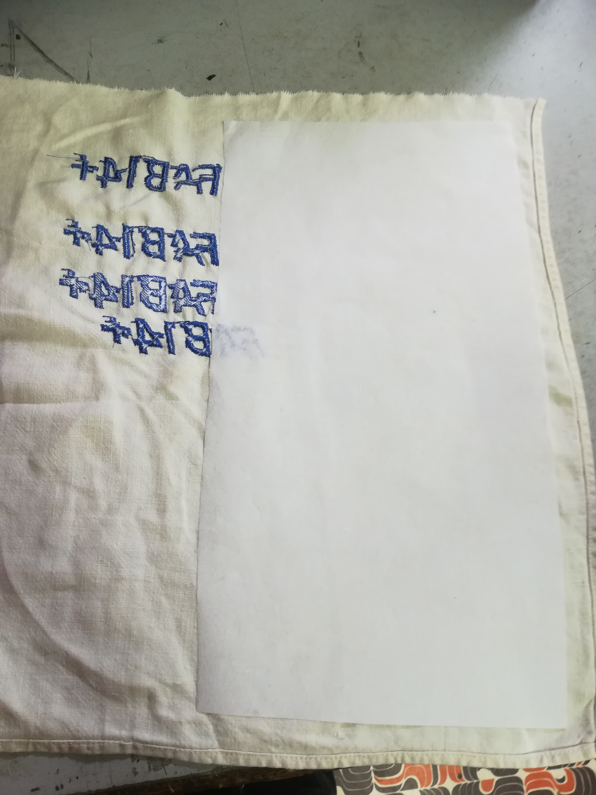
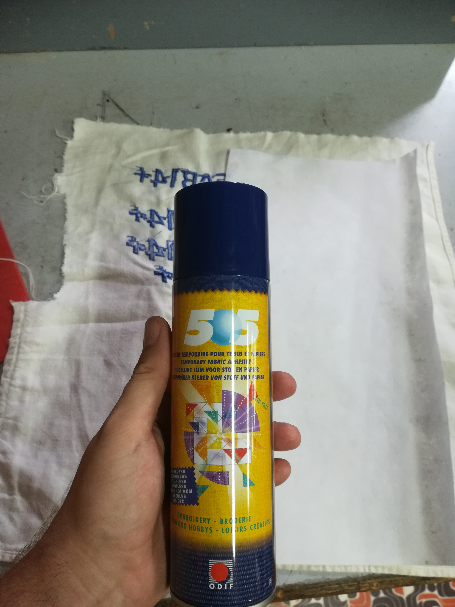
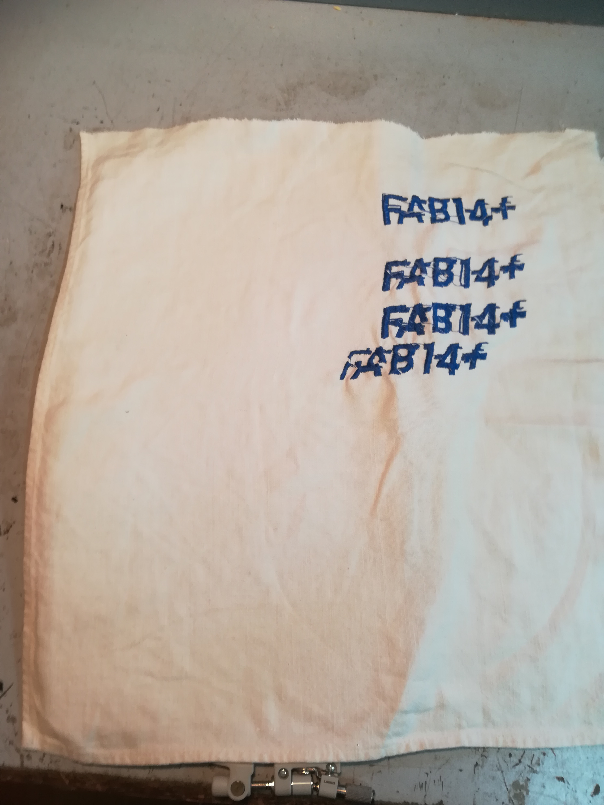
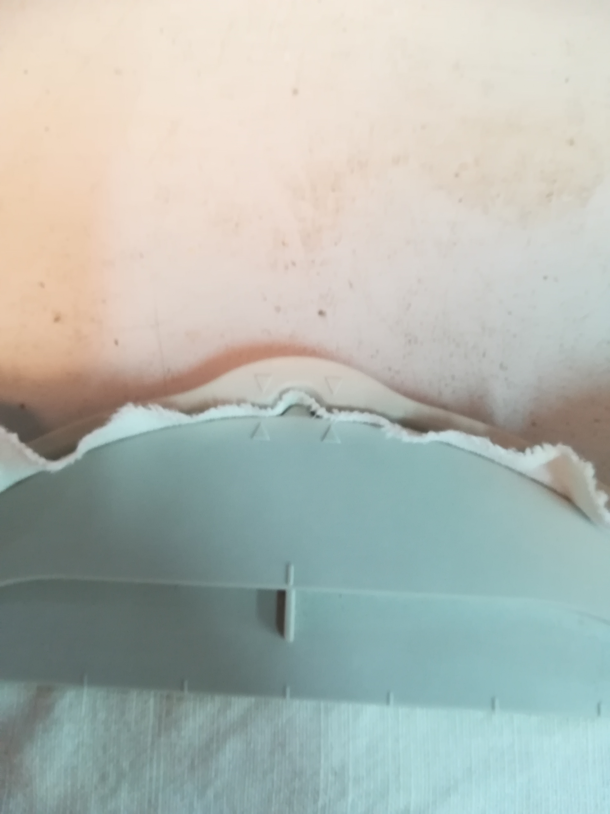
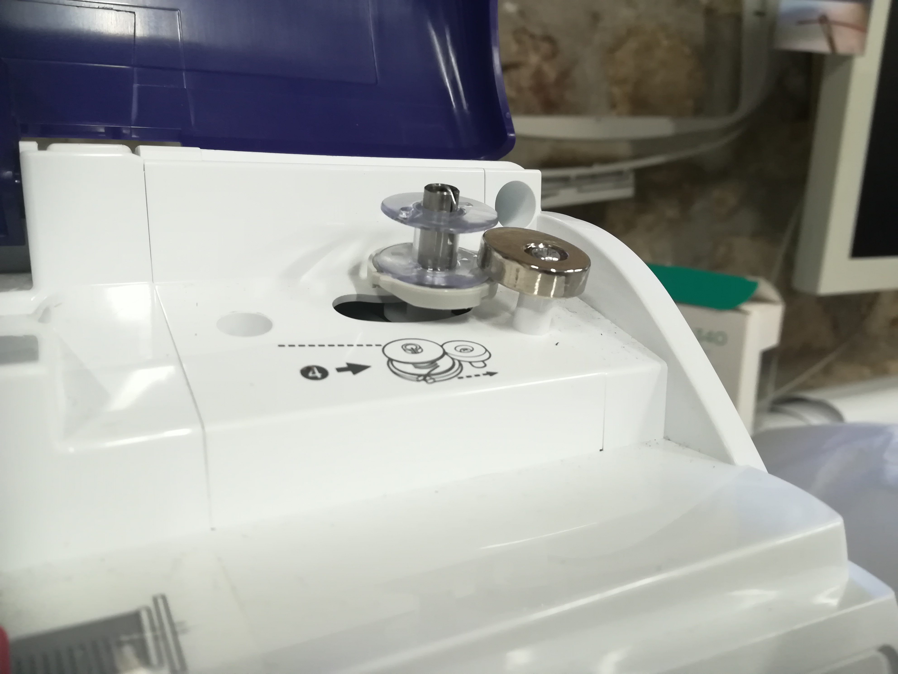

# TUTO Broderie numérique avec Inkscape
## Motif
### Inkscape et Ink/stitch
#### préparer son motif
Nous allons partir d’un motif que vous avez fait vous même ou récupérer d’internet.

Tout d’abord, importez votre motif dans Inkscape

Vectorisez-le (**clic droit → vectoriser un objet matriciel**)

Assurez-vous d’en faire un chemin (**Ctrl+Maj+c OU chemin → objet en chemin**) afin que le logiciel soit capable de le convertir en  broderie et, si besoin, simplifiez-le (**Ctrl+l**) une ou deux fois afin d’éviter une broderie inutilement complexe (note : dans certains cas, un motif trop complexe engendrera tout simplement un refus de conversion de la part du plugin Inkstitch)

Une fois votre forme de base préparée, il est temps de faire les réglages de la broderie.
Pour ce faire, allez dans **Extension → Ink/Stitch → français** où vous trouverez les options suivantes

1. Broder… : exporte votre fichier de broderie
2. commandes : donne accès à différentes commandes de brodeuse comme couper le fil ou ignorer un élément
3. imprimer : préparer un aperçu pour faire notamment un bon de commande, avoir une estimation du temps de travail
4. lettering : permet de faire un lettrage basique (encore en développement)
5. installer des extensions pour inkscape : à permis l’installation de la palette brother
6. paramètres : permet de configurer la broderie pour obtenir le résultat souhaité
7. Satin Tools : permet de gérer les broderies de type satin à partir de lignes simple (encore en développement)

Ink/Stitch détecte automatiquement le type de travail recherché en fonction des éléments de votre forme (par exemple un fond est un remplissage par défaut) et les ordonne de la couche inférieure vers la couche supérieure.

Pour avoir les réglages qui vous conviennent, sélectionnez votre forme puis allez dans
Extension → ink/stitch → français → paramètres
Vous vous retrouverez alors face au menu suivant :  

comme vous pouvez le voir, ce menu offre également un aperçu « en temps réel » vous permettant ainsi de faire des essais sur les différents paramètres proposés et d’avoir une idée approximative du résultat final.
#### le remplissage
**ATTENTION !
Cette section, ainsi que la suivante, part du principe que vous utilisez un tissu qui n’as pas de sens particulier et que votre forme reste assez simple.
Je recommande d’avoir un échantillon « test » de votre tissu vous permettant de vérifier vos réglages avant de vous lancer dans une broderie complète.**

Ink/stitch à détecter que vous vouliez faire un remplissage, et vous êtes face à une pile de réglage auxquels vous ne comprenez rien car vous ne vous y connaissez pas (encore) en broderie, pas de soucis : voici quelques conseils pour avoir un remplissage correct facilement.

Tout d’abord, allez dans l’onglet **« sous-couche de remplissage automatique »** et cochez la case **« sous-couche »**.
Maintenant changez la valeur **« angle»** pour qu’elle ai **un décalage de 90° entre la sous-couche et le remplissage.**
Enfin, changez l’**espacement entre les lignes**, en général **une différence de 0,05 entre la sous-couche et le remplissage (espacement plus gros pour la sous-couche)** donne un résultat plutôt correct.
#### le contour
Une méthode pour ne pas se prendre la tête au moment de faire un contour consiste à grossir le contour d’un objet (**fenêtre fond et contour → Style de contour → épaisseur**) puis de le convertir en chemin (**chemin → contour en chemin**) le contour deviendra donc un remplissage, il ne vous reste plus qu’à suivre les instruction du **remplissage**
#### exporter son motif
Maintenant que votre forme est prête, enregistrez votre fichier puis lancez l’exportation de celui-ci en tant que motif de broderie. Pour se faire, allez dans **Extensions→ Ink/Stitch → Français →  Broder…**

Cela vous ouvre un menu pour choisir le format (**pour la brother, prenez .pes**) ainsi que la destination du fichier de broderie.
**Choisissez un support USB comme destination**

Cliquez sur Appliquer, Ink/Stitch va alors lancer l’export du fichier de broderie sous un nom de type **<nom_du_fichier>.pes.**

Au cas où vous exporteriez plusieurs fois au même endroit un fichier de broderie à partir du même motif, Ink/Stitch sauvegarderais alors le nouveau fichier sous le nom <nom_du_fichier>.pes puis renommerait l’ancien fichier <nom_du_fichier>.pes.1 en allant de 1 à 5 avant d’écraser les versions les plus anciennes.

### Le lettrage
La meilleure solution concernant le lettrage pour l’instant est tout simplement de convertir un texte tapper avec Inkscape en chemin de broderie.

Pour se faire, tapez votre texte tel que vous le souhaitez à l’aide de l’outil écriture d’Inkscape.
Assurez-vous d’avoir un fond valide puis faites **chemin → objet en chemin.**
Maintenant, votre texte sera considérer comme un objet brodable classique.
## Machine
### Préparer la machine
#### Mise en place du fil
Commencez par mettre la machine sous tension à l’aide du bouton on/off situé sur sa droite.
Elle affichera alors une annonce pour prévenir du déplacement du support de broderie, appuyez juste sur « **ok** » sur l’écran tactile et la machine sera prête à l’emploi.
**VÉRIFIEZ LE NIVEAU DE LA CANNETTE !
Pour se faire, regardez dans la trappe située au milieu de la machine, vous y verrez une petite bobine, il s’agit de la cannette.
Si jamais cette dernière se vide pendant votre broderie, la machine arrêtera le travail en cours et vous vous verrez contraint de changer la bobine en cours de route.
Si jamais la canette est vide, ou trop peu remplie pour faire tout votre travail, référez-vous à la section 1.3 : que faire si la cannette est vide ?**
Assurez-vous que le pied-de-biche et l’aiguille soient relevés, si ce n’est pas le cas ,vous pouvez  y remédier à l’aide des boutons « **position aiguille** » et « Position pied-de-biche » (ou du levier à l’arrière de la machine).

mettez la bobine de fil sur le porte bobine, pensez à le coincer entre les deux disques de maintien.

une fois ceci fait , il ne vous reste plus qu’à faire passer le fil en suivant les nombres et les **flèches pleines** pour les étapes 1 à 8.
pour l’étape 6, pensez à bien coincer le fil dans le **guide-fil.**

Enfin, abaissez le levier se situant à la gauche de la machine pour passer le fil dans l’aiguille. Il ne faut pas hésiter à y mettre un peu de force, sans y aller comme un bourrin pour autant,

#### Préparation du tissu
prenez votre support de broderie (le grande à une surface de 260x160mm et le petit, une surface de 100x100mm) les supports sont en deux parties, une inférieure (avec vis) et une supérieure.

découpez votre surface de renfort

Prenez un tissu à un format qui vous convient, il doit au moins être un peu plus grand que votre support

Prenez le renfort et voyez ce dont vous avez besoin. Vous n’avez besoin de couvrir qu’une surface légèrement supérieure au motif que vous souhaitez broder

mettez **un peu** de spray adhésif sur le renfort et collez le au tissu

placez votre tissu sur le cadre inférieur de votre support (la partie avec des vis de serrage)

posez le cadre supérieur du support et alignez les flèches des deux cadres afin de **bien coincer le tissu.**

Serrez le cadre et assurez vous que le tissu soit **bien tendu**

Vous pouvez maintenant glisser le support dans la partie prévue à cet effet sur la machine pour se faire, levez le levier, glissez la tige du cadre de broderie et abaissez le levier.

#### Que faire si la cannette est vide ?
Si jamais la canette est vide, pas de panique, commencez par ouvrir la trappe dans laquelle elle se trouve.

retirez la canette, mettez la sur le support de bobinage et enclenchez ce dernier.

Prenez le fil de canette (grosse bobine blanche), placez le sur le support de fil et suivez les flèches en pointillé partant vers la canette. Enroulez un peu du fil autour de la canette

Il ne vous reste plus qu’à appuyer sur le bouton de bobinage, éclairée en orange.
ATTENTION la machine ne s’arrête pas automatiquement, il faut l’arrêter manuellement dès que le rythme de bobinage ralentit.

### importer son motif et démarrer la broderie
Maintenant que votre fichier est sur un support, il ne vous reste plus qu’à brancher le support en question sur le port USB de la machine, appuyer sur l’icône « USB » de la machine.

Vous arriverez alors sur un écran vous permettant de naviguer dans votre clé USB, à partir de là, vous pouvez aller dans le dossier contenant vos fichiers de broderie et sélectionner celui qui vous intéresse.

Vous voilà désormais sur un écran représentant votre cadre à gauche et avec différentes options à droite qui sont

1) Zoom
2) déplacer le motif sur la grille
3)visualisation du placement du motif par rapport au support
4) modifier la taille du motif
5) faire pivoter le motif
6) changer la couleur du motif
7)inverser le motif sur l’axe vertical
8) remplissage de la broderie (texte seulement)
9) réglages du texte
10) effacer le motif

Durant toutes ces modifications, le cadre de broderie restera sur place, mais dès que vous les aurez validé, la machine se mettre en position.
Une fois tous vos réglages prêt, appuyez sur « **fin edit**. », vous vous retrouvez face à un menu très similaire à celui de placement du motif, mais cette fois la machine déplacera le cadre de broderie, vous pourrez ainsi avoir une meilleure idée de l’emplacement de votre broderie.

À partir de cet écran, vous pouvez aussi appuyer sur la touche contour (le carré en pointillé fléché) vous permettant de vous placer sur les bords du motif, et en faire le tour afin d’avoir une idée plus précise de l’emplacement de cette dernière.

Une fois ceci fait, il ne vous reste plus qu’à appuyer sur « broderie ».
Vous serez alors amener à l’écran « broderie », vous listant les travaux prévus.
Le bouton +/- vous permet ici de choisir à quel moment de la broderie vous voulez être au coup d’aiguille près !

Vous n’avez plus qu’à appuyer sur le bouton d’abaissement du pied de biche, le bouton de lancement de la broderie passera ainsi du rouge au vert, vous signalant que la broderie débutera dès que vous appuierez dessus.

Une fois la borderie terminée, vous pouvez sortir le cadre, retirer le support et découper votre broderie pour la récupérer.
